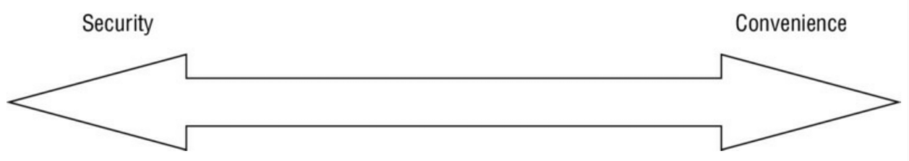
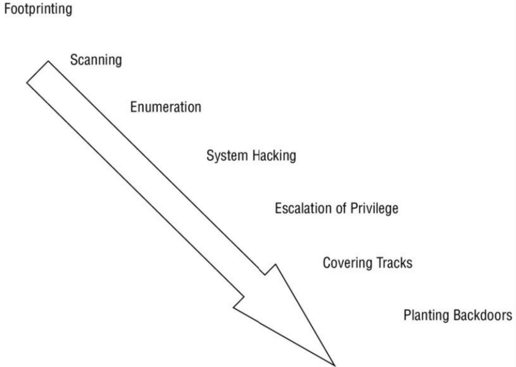

# هکر قانونمند کیست؟

وقتی **این مجموعه** و ابزارهایی را که ارائه می‌دهد بررسی می‌کنید، در حال یادگیری مهارت‌های یک هکر هستید. اما نمی‌توانیم به همین بسنده کنیم، زیرا شما باید یک **هکر قانونمند (Ethical Hacker)** باشید، پس بیایید بررسی کنیم که این به چه معناست.

هکرهای قانونمند یا از طریق قرارداد و یا استخدام مستقیم برای تست امنیت یک سازمان به کار گرفته می‌شوند. آن‌ها از همان مهارت‌ها و تاکتیک‌های یک هکر استفاده می‌کنند، اما با **اجازه** مالک سیستم برای انجام حمله علیه سیستم. علاوه بر این، هکرهای قانونمند ضعف‌های یک سیستم ارزیابی‌شده را برای هیچ‌کس جز مالک سیستم فاش نمی‌کنند. در نهایت، هکرهای قانونمند تحت قرارداد برای یک شرکت یا مشتری کار می‌کنند و قراردادهای آن‌ها مشخص می‌کند که چه کارهایی ممنوع است و چه انتظاراتی از آن‌ها می‌رود. نقش آن‌ها به نیازهای خاص یک سازمان بستگی دارد. در واقع، برخی سازمان‌ها تیم‌هایی را به طور اختصاصی برای انجام فعالیت‌های هک قانونمند در استخدام خود دارند.

## انواع هکرها

دسته‌بندی‌های زیر برای هکرها وجود دارد:

*   **Script Kiddies (بچه‌های اسکریپتی):** این هکرها آموزش محدود یا هیچ آموزشی ندارند و فقط می‌دانند چگونه از تکنیک‌ها یا ابزارهای پایه استفاده کنند. حتی در آن صورت هم ممکن است هیچ‌چیز یا بخشی از کاری را که انجام می‌دهند، درک نکنند.
*   **White-Hat Hackers (هکرهای کلاه‌سفید):** این هکرها مانند طرف مهاجم فکر می‌کنند اما برای «آدم‌های خوب» کار می‌کنند. آن‌ها معمولاً با داشتن یک منشور اخلاقی مشخص می‌شوند که اساساً می‌گوید هیچ آسیبی نخواهند رساند. این گروه به نام‌های هکرهای قانونمند یا پنتستر (Pentester) نیز شناخته می‌شوند.
*   **Gray-Hat Hackers (هکرهای کلاه‌خاکستری):** این هکرها روی مرز بین خوب و بد حرکت می‌کنند و تصمیم گرفته‌اند اصلاح شوند و به سمت خوب بپیوندند. حتی پس از اصلاح شدن، ممکن است هنوز کاملاً قابل اعتماد نباشند.
*   **Black-Hat Hackers (هکرهای کلاه‌سیاه):** این هکرها «آدم‌های بد» هستند که در سمت مخالف قانون عمل می‌کنند. آن‌ها ممکن است هدف خاصی داشته باشند یا نداشته باشند. در بیشتر موارد، هک کلاه‌سیاه و فعالیت‌های آشکارا مجرمانه تفاوت چندانی با هم ندارند.
*   **Suicide Hackers (هکرهای انتحاری):** این هکرها سعی می‌کنند برای اثبات یک نکته، هدفی را از کار بیندازند. آن‌ها مخفی‌کار نیستند، زیرا نگران دستگیر شدن یا زندان رفتن نیستند.

## مسئولیت‌های شما چیست؟

یکی از جزئیاتی که باید خیلی زود درک کنید و هرگز فراموش نکنید، **اجازه (Permission)** است. به عنوان یک هکر قانونمند، هرگز نباید سیستمی یا شبکه‌ای را که مالک آن نیستید یا اجازه تست آن را ندارید، هدف قرار دهید. اگر این کار را انجام دهید، مرتکب جرایم متعددی شده‌اید که نه‌تنها برای حرفه شما، بلکه شاید برای آزادی شما نیز زیان‌بار باشد. قبل از اینکه هدفی را تست کنید، باید قراردادی در دست داشته باشید که مالک در آن به شما اجازه انجام این کار را داده باشد.

همچنین به یاد داشته باشید که فقط باید مواردی را تست کنید که برای تست آن‌ها قرارداد بسته‌اید. اگر مشتری یا کارفرما تصمیم گرفت مواردی را به تست اضافه یا از آن حذف کند، قرارداد باید تغییر کند تا هر دو طرف از مشکلات قانونی دور بمانند. توجه ویژه داشته باشید که هکرهای قانونمند با قراردادهایی که بین خود و هدف منعقد شده است، عمل می‌کنند. فعالیت بدون اجازه غیراخلاقی است؛ فعالیت بدون قرارداد کاملاً احمقانه و غیرقانونی است.

علاوه بر این، یک قرارداد باید شامل عباراتی باشد که به مسئله **محرمانگی و حریم خصوصی** می‌پردازد. ممکن است در طول یک تست با اطلاعات محرمانه مواجه شوید یا دانش دقیقی از شبکه مشتری خود پیدا کنید. به عنوان بخشی از قرارداد خود، باید مشخص کنید که اجازه دارید یافته‌های خود را با چه کسانی در میان بگذارید و با چه کسانی نه. معمولاً مشتریان می‌خواهند یافته‌های خود را فقط با آن‌ها و نه هیچ‌کس دیگری در میان بگذارید.

طبق اعلام شورای بین‌المللی مشاوران تجارت الکترونیک (**EC-Council**)، شما به عنوان یک **CEH**، باید هرگونه اطلاعات محرمانه به دست آمده در کار حرفه‌ای خود را (به‌ویژه در مورد لیست مشتریان و اطلاعات شخصی مشتری) خصوصی نگه دارید. شما نمی‌توانید هیچ اطلاعات شخصی (مانند نام، آدرس ایمیل، شماره تأمین اجتماعی یا سایر شناسه‌های منحصر‌به‌فرد) را بدون رضایت قبلی مشتری جمع‌آوری کنید، بدهید، بفروشید یا به شخص ثالث منتقل کنید. این را در نظر داشته باشید زیرا نقض این کد نه‌تنها می‌تواند باعث از دست دادن اعتماد مشتری شود، بلکه شما را درگیر مشکلات قانونی نیز می‌کند.

:::tip
قراردادها جزئیات مهمی هستند که باید درست انجام شوند؛ اگر آن‌ها را اشتباه انجام دهید، می‌تواند به راحتی به معنای مشکلات قانونی بعدی باشد. مشکل قراردادها این است که اکثر مردم زبان حقوقی را تقریباً غیرقابل فهم و میزان آمادگی لازم را دلهره‌آور می‌دانند. من قویاً توصیه می‌کنم که برای کمک در زمینه قراردادها، از یک وکیل باتجربه در این زمینه کمک بگیرید.
یک قرارداد به یک دلیل بسیار مهم دیگر نیز ضروری است: **مدرک (Proof)**. بدون قرارداد، شما هیچ مدرک واقعی ندارید که نشان دهد از مالک سیستم برای انجام هرگونه تستی اجازه دارید.
:::

زمانی که هکرهای قانونمند مجوزها و قراردادهای لازم را داشته باشند، می‌توانند درگیر **تست نفوذ (Penetration Testing)** شوند که به عنوان Pen Testing نیز شناخته می‌شود. این روشی ساختاریافته و روشمند برای بررسی، کشف، حمله و گزارش‌دهی در مورد نقاط قوت و آسیب‌پذیری‌های یک سیستم هدف است. در شرایط مناسب، تست نفوذ می‌تواند اطلاعات فراوانی را ارائه دهد که مالک سیستم می‌تواند از آن برای برنامه‌ریزی و تنظیم دفاعی استفاده کند.

## هکرهای خوب و بد، یا هکرها و هکرهای قانونمند

تفاوت بین یک هکر قانونمند و یک هکر چیزی است که می‌تواند به راحتی شما را وارد یک بحث کند. فقط گفتن کلمه «هکر» در جای اشتباه می‌تواند شما را وارد یک گفتگوی چند ساعته درباره تاریخچه هک کند و اینکه چگونه همه هکرها آدم‌های خوبی هستند که جز خیر برای دنیا نمی‌خواهند. دیگران به شما خواهند گفت که هکرها همه شرور هستند و جز نیت بد ندارند.

باید درک کنید که برای ما، هکرها بر اساس **نیت‌ها** از هم جدا می‌شوند. در جهان‌بینی ما، هکرهایی که قصد آسیب رساندن دارند یا برای فعالیت‌های خود اجازه ندارند، **کلاه‌سیاه** در نظر گرفته می‌شوند، در حالی که کسانی که اجازه دارند و فعالیت‌هایشان خیرخواهانه است، **کلاه‌سفید** هستند. نامیدن یک طرف به عنوان خوب و طرف دیگر به عنوان بد ممکن است بحث‌برانگیز باشد، اما در **این مجموعه** ما به این اصطلاحات پایبند خواهیم بود:

*   **کلاه‌سیاه‌ها (Black Hats):** آن‌ها برای فعالیت‌های خود اجازه یا مجوز ندارند؛ معمولاً اقدامات آن‌ها خارج از قانون است.
*   **کلاه‌سفیدها (White Hats):** آن‌ها برای انجام وظایف خود اجازه دارند. کلاه‌سفیدها هرگز اطلاعات مربوط به یک مشتری را با کسی غیر از آن مشتری به اشتراک نمی‌گذارند.
*   **کلاه‌خاکستری‌ها (Gray Hats):** این هکرها در زمان‌های مختلف وارد اقدامات تهاجمی و تدافعی می‌شوند.

نوع دیگری از هکر، **هکتیویست (Hacktivist)** است. هکتیویسم هر اقدامی است که یک مهاجم برای پیشبرد یا ترویج یک دستور کار سیاسی استفاده می‌کند. اهداف هکتیویست‌ها شامل سازمان‌های دولتی و شرکت‌های بزرگ بوده است.

## منشور رفتار و اخلاقیات

به عنوان یک هکر قانونمند، باید اطمینان حاصل کنید که به یک منشور رفتار یا اخلاقیات پایبند هستید تا قابل اعتماد (و شاغل) باقی بمانید. در مورد مدرک CEH از EC-Council، از شما انتظار می‌رود که در معاملات خود به **منشور اخلاقی (Code of Ethics)** آن‌ها پایبند باشید، در غیر این صورت مدرک شما باطل می‌شود.

برای اطمینان از اینکه کاملاً درک می‌کنید وقتی یک CEH شدید، انتظار می‌رود به چه چیزی پایبند باشید، من منشور اخلاقی رسمی EC-Council را در اینجا (با کمی بازنویسی برای وضوح) ارائه کرده‌ام. آن را بخوانید و بدانید تا مطمئن شوید با تمام انتظاراتی که از شما به عنوان یک CEH می‌رود، راحت هستید:

1.  اطلاعات خصوصی و محرمانه‌ای را که در کار حرفه‌ای خود به دست می‌آورید (به‌ویژه در مورد لیست مشتریان و اطلاعات شخصی مشتری) حفظ کنید.
2.  بدون رضایت قبلی مشتری، هیچ اطلاعات شخصی (مانند نام، آدرس ایمیل، شماره تأمین اجتماعی یا سایر شناسه‌های منحصر‌به‌فرد) را جمع‌آوری نکنید، ندهید، نفروشید یا به شخص ثالث منتقل نکنید.
3.  با تکیه بر نوآوری و تلاش‌های خود از مالکیت معنوی دیگران محافظت کنید و بدین ترتیب اطمینان حاصل کنید که تمام منافع به پدیدآورنده آن تعلق می‌گیرد.
4.  خطرات بالقوه برای هر مشتری تجارت الکترونیک، جامعه اینترنت یا عموم مردم را که منطقاً باور دارید با مجموعه‌ای خاص یا نوعی از تراکنش‌های الکترونیکی یا نرم‌افزار یا سخت‌افزار مرتبط است، به افراد یا مقامات مناسب افشا کنید.
5.  در حوزه‌های صلاحیت خود خدمات ارائه دهید و در مورد هرگونه محدودیت در تجربه و تحصیلات خود صادق و روراست باشید.
6.  اطمینان حاصل کنید که برای هر پروژه‌ای که روی آن کار می‌کنید یا پیشنهاد کار می‌دهید، با ترکیبی مناسب از تحصیلات، آموزش و تجربه، واجد شرایط هستید.
7.  هرگز آگاهانه از نرم‌افزار یا فرآیندی که به صورت غیرقانونی یا غیراخلاقی به دست آمده یا نگهداری شده است، استفاده نکنید.
8.  درگیر اعمال مالی فریبکارانه مانند رشوه، صورت‌حساب دوبل یا سایر اعمال مالی نامناسب نشوید.
9.  از اموال مشتری یا کارفرما فقط به روش‌هایی که به درستی مجاز شده و با اطلاع و رضایت مالک است، استفاده کنید.
10. تضاد منافعی را که به طور معقول قابل اجتناب یا گریز نیستند، برای تمام طرف‌های ذینفع افشا کنید.
11. مدیریت خوب را برای هر پروژه‌ای که رهبری می‌کنید تضمین نمایید، از جمله رویه‌های مؤثر برای ارتقای کیفیت و افشای کامل ریسک.
12. با مطالعه مداوم به دانش حرفه تجارت الکترونیک بیفزایید، درس‌های تجربه خود را با سایر اعضای EC-Council به اشتراک بگذارید و آگاهی عمومی از مزایای تجارت الکترونیک را ترویج دهید.
13. هنگام درخواست خدمات حرفه‌ای یا جستجوی کار، خود را به اخلاقی‌ترین و شایسته‌ترین شیوه هدایت کنید تا شایسته اعتماد به دانش و صداقت خود باشید.
14. رفتار اخلاقی و مراقبت حرفه‌ای را در همه حال و در تمام مأموریت‌های حرفه‌ای بدون تعصب تضمین کنید.
15. با هکرهای مخرب معاشرت نکنید و در هیچ فعالیت مخربی شرکت نکنید.
16. سیستم‌های سازمان مشتری را در جریان معاملات حرفه‌ای خود عمداً به خطر نیندازید یا باعث به خطر افتادن آن‌ها نشوید.
17. اطمینان حاصل کنید که تمام فعالیت‌های تست نفوذ مجاز و در محدوده قانونی هستند.
18. در هیچ فعالیت کلاه‌سیاهی شرکت نکنید و با هیچ جامعه کلاه‌سیاهی که به شبکه ها آسیب می‌زند، مرتبط نباشید.
19. بخشی از هیچ جامعه هکری زیرزمینی با هدف تبلیغ و گسترش فعالیت‌های کلاه‌سیاه نباشید.
20. ارجاع نامناسب به گواهینامه یا استفاده گمراه‌کننده از گواهینامه‌ها، علائم یا لوگوها در نشریات، کاتالوگ‌ها، اسناد یا سخنرانی‌ها نداشته باشید.
21. ناقض هیچ‌یک از قوانین کشور نباشید و سابقه محکومیت قبلی نداشته باشید.

## هک قانونمند و تست نفوذ

هکرهای قانونمند درگیر هک مجاز هستند — یعنی هک با اجازه مالک سیستم. در دنیای هک قانونمند، اکثر افراد تمایل دارند از اصطلاح **«پنتستر»** استفاده کنند که مخفف **تست‌کننده نفوذ** (Penetration Tester) است. پنتسترها دقیقاً همین کار را انجام می‌دهند: مانند یک هکر به سیستم‌ها نفوذ می‌کنند، اما برای اهداف خیرخواهانه.

به عنوان یک هکر قانونمند و داوطلب آینده آزمون، باید با اصطلاحات این حرفه آشنا شوید. در اینجا برخی از اصطلاحاتی که در تست نفوذ با آن‌ها مواجه خواهید شد آورده شده است:

*   **ارزش هک (Hack Value):** این اصطلاح هدفی را توصیف می‌کند که ممکن است سطحی بالاتر از حد متوسط از توجه یک مهاجم را جلب کند. احتمالاً به این دلیل که این هدف جذاب است، به دلیل آنچه ممکن است در خود داشته باشد، ارزش بیشتری برای مهاجم دارد.
*   **هدف ارزیابی (Target of Evaluation - TOE):** سیستم یا منبعی است که برای آسیب‌پذیری‌ها در حال ارزیابی است. TOE در قرارداد با مشتری مشخص می‌شود.
*   **حمله (Attack):** عمل هدف‌گیری و درگیر شدن فعال با یک TOE.
*   **اکسپلویت (Exploit):** روشی کاملاً تعریف شده برای نقض امنیت یک سیستم.
*   **روز صفر (Zero Day):** تهدید یا آسیب‌پذیری که برای توسعه‌دهندگان ناشناخته است و برطرف نشده است. این مورد در بسیاری از موارد یک مشکل جدی محسوب می‌شود.
*   **امنیت (Security):** وضعیت سلامت در محیطی که در آن فقط اقدامات تعریف‌شده مجاز هستند.
*   **تهدید (Threat):** نقض بالقوه امنیت در نظر گرفته می‌شود.
*   **آسیب‌پذیری (Vulnerability):** ضعفی در سیستم که می‌تواند مورد حمله قرار گیرد و به عنوان نقطه ورود به یک محیط استفاده شود.
*   **زنجیره (Daisy Chaining):** عمل انجام چندین حمله هکری به صورت متوالی که هر کدام بر اساس نتایج اقدام قبلی بنا شده یا عمل می‌کند.

به عنوان یک هکر قانونمند، از شما انتظار می‌رود که نقش و طرز فکر و مهارت‌های یک مهاجم را برای شبیه‌سازی یک حمله مخرب به عهده بگیرید. ایده این است که هکرهای قانونمند هر دو طرف، خوب و بد را درک کنند و از این دانش برای کمک به مشتریان خود استفاده نمایند. با درک هر دو طرف معادله، آمادگی بهتری برای دفاع موفق از خود خواهید داشت. در اینجا نکاتی وجود دارد که باید در مورد هکر قانونمند بودن به خاطر بسپارید:

*   شما باید قبل از شروع هر فعالیتی، **اجازه کتبی صریح** از شرکت تحت تست داشته باشید. از نظر قانونی، فرد یا افرادی که باید این فعالیت یا تغییرات در برنامه را تایید کنند، باید مالک شرکت یا نماینده مجاز آن‌ها باشند. اگر دامنه کار تغییر کرد، قبل از انجام وظایف جدید باید قرارداد را برای بازتاب آن تغییرات به‌روز کنید.
*   شما از همان تاکتیک‌ها و استراتژی‌های مهاجمان مخرب استفاده خواهید کرد.
*   شما پتانسیل ایجاد همان آسیبی را دارید که یک حمله مخرب ایجاد می‌کند و باید همیشه اثرات هر اقدامی را که انجام می‌دهید در نظر بگیرید.
*   شما باید از هدف و ضعف‌هایی که دارد آگاهی داشته باشید.
*   شما باید قبل از شروع کار محول شده، **قوانین درگیری (Rules of Engagement)** کاملاً تعریف شده‌ای داشته باشید.
*   هرگز نباید اطلاعات مربوط به یک مشتری را برای کسی جز خود مشتری فاش کنید.
*   اگر مشتری از شما خواست تستی را متوقف کنید، بلافاصله این کار را انجام دهید.
*   باید گزارشی از نتایج خود ارائه دهید و در صورت درخواست، خلاصه‌ای از هرگونه نقص یافت شده در طول تست ارائه نمایید.
*   ممکن است از شما خواسته شود برای رفع هر مشکلی که پیدا می‌کنید با مشتری همکاری کنید. همان‌طور که چندین بار در این متن بحث خواهم کرد، هرگز توافق شفاهی برای گسترش پارامترهای تست را نپذیرید. توافق شفاهی هیچ سابقه‌ای ندارد و اگر مشکلی پیش بیاید و مدرکی وجود نداشته باشد، احتمال شکایت از شما وجود دارد.

در شرایط مناسب و با برنامه‌ریزی و اهداف صحیح، می‌توانید اطلاعات ارزشمند زیادی را به سازمان هدف خود ارائه دهید. با همکاری با مشتری خود، باید نتایج را به طور کامل تحلیل کنید و تعیین نمایید که کدام حوزه‌ها نیاز به توجه دارند و کدام‌ها اصلاً نیاز ندارند. مشتری شما تعادل کامل بین **امنیت در مقابل راحتی (Security versus Convenience)** را تعیین خواهد کرد. اگر مشکلاتی که کشف می‌کنید مستلزم اقدام باشد، چالش بعدی اطمینان از این است که اگر کنترل‌های امنیتی اصلاح شوند یا موارد جدیدی اعمال شوند، قابلیت استفاده (Usability) موجود تحت تأثیر منفی قرار نگیرد. امنیت و راحتی اغلب در تضاد هستند: هرچه یک سیستم امن‌تر شود، تمایل به راحت بودن آن کمتر می‌شود.

    **شکل ۱:** تحلیل امنیت در مقابل راحتی

اگرچه هک قانونمند گاهی بدون مجموعه رسمی از قوانین درگیری رخ می‌دهد، تست نفوذ (Pen testing) در هر موردی نیاز دارد که قوانین از قبل توافق شده باشند. اگر تصمیم بگیرید بدون تعیین پارامترهای خاص از قبل، تست نفوذ انجام دهید، اگر اتفاق بسیار بدی بیفتد، ممکن است پایان کار حرفه‌ای شما باشد.

زمانی که یک تست نفوذ انجام می‌شود، معمولاً یکی از سه شکل را به خود می‌گیرد: **جعبه سفید، جعبه خاکستری، یا جعبه سیاه**. تمایز این سه شکل تست مهم است زیرا ممکن است در مقطعی از حرفه خود از شما خواسته شود هر یک از آن‌ها را انجام دهید:

1.  **جعبه سیاه (Black Box):** نوعی تست که در آن پنتستر دانش کم یا هیچ دانشی از هدف ندارد. این وضعیت طراحی شده است تا موقعیتی را که یک مهاجم واقعی با آن روبرو می‌شود از نزدیک شبیه‌سازی کند، زیرا آن‌ها احتمالاً سطح دانش بسیار پایینی از هدف دارند.
2.  **جعبه خاکستری (Gray Box):** شکلی از تست که در آن دانش داده شده به طرف تست‌کننده محدود است. در این نوع تست، تست‌کننده دانشی مانند آدرس‌های IP، سیستم‌عامل‌ها و محیط شبکه را به دست می‌آورد، اما آن اطلاعات محدود است. این نوع تست، نوع دانشی را که ممکن است فردی در داخل سازمان داشته باشد، از نزدیک شبیه‌سازی می‌کند.
3.  **جعبه سفید (White Box):** شکلی از تست که در آن اطلاعات داده شده به تست‌کننده کامل است. این بدان معنی است که تمام اطلاعات مربوط به سیستم هدف به پنتستر داده می‌شود. این نوع تست معمولاً به صورت داخلی یا توسط تیم‌هایی که ممیزی‌های داخلی سیستم‌ها را انجام می‌دهند، صورت می‌گیرد.

جدول ۱ نگاهی دیگر به انواع مختلف تست و نحوه مقایسه آن‌ها دارد.

    **جدول ۱: انواع موجود تست‌های نفوذ**
    | نوع | سطح دانش |
    | :---: | :---: |
    | **جعبه سفید** | کامل (Full) |
    | **جعبه خاکستری** | محدود (Limited) |
    | **جعبه سیاه** | هیچ (None) |

:::tip
اصطلاحات جعبه سیاه، جعبه سفید و جعبه خاکستری را فراموش نکنید زیرا دوباره هم در **این مطالب** و هم در میدان عمل با آن‌ها روبرو خواهید شد. همان‌طور که می‌بینید، درک این اصطلاحات آنقدرها هم دشوار نیست، اما همچنان باید تلاش کنید آن‌ها را به خاطر بسپارید.
:::

در بسیاری از موارد، شما آنچه را که به عنوان **ممیزی IT** شناخته می‌شود، انجام خواهید داد. این فرآیند برای ارزیابی و تأیید اینکه کنترل‌های محافظت‌کننده از یک سازمان طبق ادعا کار می‌کنند، استفاده می‌شود. یک ممیزی IT معمولاً در برابر استانداردی یا چک‌لیستی انجام می‌شود که پروتکل‌های امنیتی، توسعه نرم‌افزار، سیاست‌های مدیریتی و حاکمیت IT را پوشش می‌دهد. با این حال، قبولی در یک ممیزی IT به این معنی نیست که سیستم کاملاً ایمن است؛ معیارهای قبولی در ممیزی ممکن است در مقایسه با آنچه در حال حاضر در صنعت اتفاق می‌افتد، قدیمی باشد.

یک هکر قانونمند سعی می‌کند آنچه را که به عنوان **مثلث CIA** شناخته می‌شود، حفظ کند: **محرمانگی (Confidentiality)، یکپارچگی (Integrity)، و در دسترس بودن (Availability)**. لیست زیر این مفاهیم اصلی را شرح می‌دهد:

*   **محرمانگی:** اصل اساسی که به حفاظت از اطلاعات و دور نگه داشتن آن از کسانی که مجاز به داشتن آن نیستند، اشاره دارد. نمونه‌هایی از کنترل‌هایی که محرمانگی را حفظ می‌کنند مجوزها و رمزنگاری هستند.
*   **یکپارچگی:** با حفظ اطلاعات در قالبی که نسبت به اهداف اصلی آن درست و صحیح باشد سر و کار دارد، به این معنی که داده‌ای که گیرنده به آن دسترسی پیدا می‌کند همان داده‌ای است که سازنده قصد داشته است.
*   **در دسترس بودن:** آخرین و شاید یکی از مهم‌ترین مواردی که می‌توانید انجام دهید؛ در دسترس بودن با در دسترس نگه داشتن اطلاعات و منابع برای کسانی که نیاز به استفاده از آن دارند، سر و کار دارد. اطلاعات یا منابع، هر چقدر هم که امن و سالم باشند، تنها در صورتی مفید هستند که در زمان نیاز در دسترس باشند.

> **CIA** احتمالاً مهم‌ترین مجموعه اهدافی است که باید هنگام ارزیابی و برنامه‌ریزی امنیت برای یک سیستم حفظ شود. یک متجاوز سعی خواهد کرد هنگام هدف قرار دادن یک سیستم، این اهداف را بشکند یا مختل کند. به عنوان یک هکر قانونمند، کار شما این است که هر زمان این مسائل کشف شدند، آن‌ها را پیدا، ارزیابی و اصلاح کنید تا از آسیب رساندن متجاوز جلوگیری شود.

راه دیگر برای نگاه کردن به این تعادل، مشاهده طرف دیگر مثلث و چگونگی از دست رفتن تعادل است. هر یک از موارد زیر مثلث CIA را می‌شکنند:

*   **افشاء (Disclosure):** آشکار کردن یا اجازه دسترسی سهوی، تصادفی یا مخرب به اطلاعات یا منابع به یک طرف خارجی است. اگر شما مجاز به دسترسی به یک شیء نیستید، هرگز نباید به آن دسترسی داشته باشید.
*   **تغییر (Alteration):** نقطه مقابل یکپارچگی است؛ با تغییر غیرمجاز اطلاعات سر و کار دارد. این تغییر می‌تواند ناشی از خرابی، دسترسی تصادفی که منجر به تغییر می‌شود، یا تغییراتی که ماهیت مخرب دارند باشد.
*   **اختلال (Disruption) یا از دست دادن (Loss):** به این معنی است که دسترسی مجاز به اطلاعات یا منابع از دست رفته است. اطلاعات اگر در زمان نیاز وجود نداشته باشد، بی فایده است.

> این سه نکته آخر را به عنوان **مثلث ضد-CIA** یا معکوس مثلث CIA در نظر بگیرید. مثلث CIA با حفظ اطلاعات و منابع سر و کار دارد، در حالی که مثلث ضد-CIA با نقض آن نکات سر و کار دارد.

همچنین مهم است که دو عنصر پشتیبان برای مثلث CIA را در نظر بگیرید که عبارتند از **عدم انکار (Non-repudiation)** و **اصالت (Authenticity)**.

*   **عدم انکار:** مفهومی است که وقتی اقدامی توسط طرفی انجام می‌شود، آن طرف نمی‌تواند آن را انکار کند. مثلاً با استفاده از تکنیک‌هایی مانند امضای دیجیتال می‌توان به طور قطع گفت چه کسی پیامی را فرستاده است، بدون اینکه امکان انکاری وجود داشته باشد.
*   **اصالت:** توانایی بیان اینکه یک شیء مانند یک قطعه داده یا پیام از یک منبع معتبر و قابل شناسایی آمده است.

## متدولوژی‌های هک (Hacking Methodologies)

متدولوژی هک به رویکرد گام‌به‌گامی اشاره دارد که توسط یک متجاوز برای حمله به هدفی مانند شبکه کامپیوتری استفاده می‌شود. هیچ رویکرد گام‌به‌گام خاصی وجود ندارد که توسط همه هکرها استفاده شود. تفاوت عمده بین یک هکر و یک هکر قانونمند، منشور اخلاقی است که هر کدام به آن پایبند هستند.

مراحل زیر به طور معمول فرآیند هک را تشکیل می‌دهند:

1.  **ردپایابی (Footprinting):** به این معنی است که شما عمدتاً از روش‌های غیرفعال برای کسب اطلاعات از یک هدف قبل از انجام روش‌های فعال بعدی استفاده می‌کنید. معمولاً تعامل با هدف خود را به حداقل می‌رسانید تا از شناسایی شدن و هشدار دادن به هدف جلوگیری کنید.
2.  **اسکن کردن (Scanning):** مرحله‌ای است که در آن شما اطلاعات به دست آمده از مرحله ردپایابی را می‌گیرید و از آن برای هدف‌گیری دقیق‌تر حمله خود استفاده می‌کنید. ایده اینجا این است که بر اساس اطلاعات مرحله قبل عمل کنید، نه اینکه کورکورانه عمل کرده و زنگ هشدارها را به صدا درآورید.
3.  **شمارش (Enumeration):** مرحله بعدی است که در آن اطلاعات بسیار دقیق‌تری درباره آنچه در مرحله اسکن کشف کرده‌اید استخراج می‌کنید تا مفید بودن آن را تعیین نمایید. نتایج این مرحله می‌تواند شامل لیستی از نام‌های کاربری، گروه‌ها، برنامه‌ها و اطلاعات حسابرسی باشد.
4.  **هک سیستم (System Hacking):** پس از شمارش می‌آید. اکنون می‌توانید بر اساس اطلاعاتی که کشف کرده‌اید، حمله‌ای را برنامه‌ریزی و اجرا کنید.
5.  **ارتقاء امتیاز (Escalation of Privilege):** مرحله هک است که در آن شروع به به دست آوردن امتیازاتی می‌کنید که به حساب‌هایی با سطح دسترسی بالاتر از آنچه ابتدا به آن نفوذ کرده‌اید، اعطا شده است.
6.  **پوشاندن ردپا (Covering Tracks):** مرحله‌ای است که تلاش می‌کنید شواهد حضور خود در سیستم را حذف کنید. فایل‌های لاگ (Log) را پاک می‌کنید و سایر مدارک را از بین می‌برید.
7.  **کاشتن درهای پشتی (Planting Backdoors):** به معنای باقی گذاشتن چیزی است که به شما امکان می‌دهد اگر خواستید بعداً بازگردید. مواردی مانند حساب‌های ویژه یا اسب‌های تروجان به ذهن می‌رسند.

    

        
    

    **شکل ۲:** فرآیند هک

هم هکرهای قانونمند و هم هکرها فرآیندهای مشابهی را دنبال می‌کنند، هرچند به روش‌های کمتر یا سختگیرانه‌تر. هکرهای قانونمند دقیقاً همین نوع فرآیند را با تغییرات اندک دنبال می‌کنند، اما چیزی را اضافه کرده‌اند که هکرها ندارند: هکرهای قانونمند نه‌تنها قبل از شروع مرحله اول **اجازه** خواهند داشت، بلکه در پایان فرآیند **گزارشی** تولید و ارائه خواهند کرد.

هنگامی که تصمیم می‌گیرید این فرآیند را انجام دهید، از راهنمایی مشتری خود کمک بگیرید و سوالات زیر را بپرسید:

*   چرا مشتری درخواست تست نفوذ کرده است؟
*   ماموریت سازمان مورد تست چیست؟
*   محدودیت‌ها یا قوانین درگیری برای تست چه خواهد بود؟
*   چه داده‌ها و سرویس‌هایی بخشی از تست خواهند بود؟
*   مالک داده کیست؟
*   بودجه چقدر است؟
*   چه منابعی در دسترس قرار خواهد گرفت؟
*   آیا به افراد داخلی اطلاع داده خواهد شد؟
*   تست به صورت جعبه سیاه انجام می‌شود یا سفید؟
*   چه شرایطی موفقیت تست را تعیین می‌کند؟

تست نفوذ می‌تواند اشکال مختلفی داشته باشد. شما باید همراه با مشتری خود تصمیم بگیرید که کدام تست‌ها مناسب هستند:

*   **حمله داخلی (Insider Attack):** برای تقلید از اقدامات کارکنان داخلی یا طرف‌هایی که دسترسی مجاز دارند.
*   **حمله خارجی (Outsider Attack):** برای تقلید از اقدامات طرف‌های خارجی.
*   **حمله تجهیزات دزدیده شده (Stolen Equipment Attack):** جایی که متجاوز قطعه‌ای از تجهیزات را می‌دزدد و از آن برای دسترسی استفاده می‌کند.
*   **حمله مهندسی اجتماعی:** جایی که پنتستر کاربران سیستم را هدف قرار می‌دهد تا اطلاعات مورد نیاز را استخراج کند.

## تحقیق آسیب‌پذیری و ابزارها

بخش مهمی از جعبه‌ابزار شما به عنوان یک هکر قانونمند، اطلاعات جمع‌آوری شده از **تحقیق آسیب‌پذیری (Vulnerability Research)** خواهد بود. این فرآیند شامل جستجو و کشف آسیب‌پذیری‌ها در یک سیستم و تعیین ماهیت آن‌هاست. علاوه بر این، این تحقیق به دنبال طبقه‌بندی هر آسیب‌پذیری به عنوان بالا، متوسط یا پایین است.

تحقیق آسیب‌پذیری با هک قانونمند یکسان نیست؛ زیرا به صورت غیرفعال (Passive) مسائل امنیتی را کشف می‌کند، در حالی که فرآیند هک قانونمند به صورت فعال (Active) به دنبال آسیب‌پذیری‌ها می‌گردد. با این حال، اسکن آسیب‌پذیری ممکن است به عنوان بخشی از یک تست استفاده شود، اما نه به تنهایی.

## پاسخ به رخداد (Incident Response) چیست؟

کار شما به عنوان پنتستر ارائه اطلاعاتی است که شانس نقض امنیت یا رخداد امنیتی را به کمترین سطح ممکن کاهش دهد. اما آیا یک کاربر معمولی هیچ مسئولیتی ندارد؟ قطعاً دارد.

یکی از اولین چیزهایی که باید هنگام فکر کردن به پاسخ به رخداد در نظر داشته باشید، این واقعیت است که ممکن است با چیزی سر و کار داشته باشید که زیر پرچم **جرم (Crime)** قرار می‌گیرد. پاسخ به یک رخداد جرایم رایانه‌ای می‌تواند چالش‌برانگیز باشد و باید به متخصصان واگذار شود زیرا شواهدی که باید جمع‌آوری شوند ناملموس هستند و اگر به آن‌ها آسیب برسانید، می‌تواند مانع از پیگرد قانونی پرونده شود.

**جرایم رایانه‌ای (Computer Crime)** به عنوان هر عمل مجرمانه‌ای تعریف می‌شود که در طی آن از کامپیوتر یا دستگاه محاسباتی در ارتکاب جرم استفاده شده باشد.

## سیاست‌های پاسخ به رخداد (Incident Response Policies)

نکته بعدی که مهم است، **سیاست پاسخ به رخداد (IRP)** است. IRP روش اقدامی را تعریف می‌کند که یک شرکت پس از یک رخداد امنیتی انجام خواهد داد. IRP معمولاً شامل موارد زیر است:

*   چه کسی تعیین می‌کند که آیا رخداد امنیتی رخ داده است یا خیر.
*   کدام افراد و/یا بخش‌ها باید مطلع شوند.
*   چه کسی مسئول پاسخگویی به رخداد خواهد بود.
*   دستورالعمل‌های پاسخ مناسب.

## فازهای رخداد و پاسخ

فرآیند پاسخ به رخداد شامل چندین فاز است. جدول ۲ آنچه را که به طور کلی توسط NIST و دیگران به عنوان فازهای پاسخ به رخداد پذیرفته شده است، پوشش می‌دهد.

**جدول ۲: فازهای پاسخ به رخداد**
| فاز | توضیحات |
| :---: | :---: |
| **تریاژ (Triage)** | مهم است که در ابتدا مشخص شود واقعاً چه اتفاقی افتاده است. آیا یک رخداد امنیتی واقعی است یا چیز دیگر؟ تیم پاسخ به رخداد مسئول این تشخیص است. |
| **تحقیق (Investigation)** | هنگامی که علت مشکل کشف شد، فرآیند تحقیق می‌تواند آغاز شود. تحقیق طراحی شده است تا شواهد را به روشی جمع‌آوری کند که از بین نروند یا تغییر نکنند. |
| **مهار (Containment)** | ضروری است که در اوایل فرآیند، صحنه جرم تا حد امکان مهار و کنترل شود. نباید هیچ تغییری در صحنه جرم رخ دهد (از جمله قطع کردن دستگاه‌ها یا خاموش کردن سیستم). |
| **تحلیل و پیگیری (Analysis and Tracking)** | شواهد جمع‌آوری شده بی‌فایده‌اند مگر اینکه بررسی و کالبدشکافی شوند. تیم‌ها مسئول تعیین این هستند که کدام شواهد مرتبط هستند. همچنین تیم باید **زنجیره حضانت (Chain of Custody)** را حفظ کند. |
| **بازیابی (Recovery)** | در این فاز فرض بر این است که تمام شواهد جمع‌آوری شده و صحنه پاکسازی شده است. سیستم‌های تحت تأثیر می‌توانند بازیابی و به سرویس بازگردانده شوند. |
| **تعمیر (Repair)** | در صورتی که سیستم در طول حمله آسیب قابل توجهی دیده باشد، تعمیر آن ضروری می‌شود. |
| **بازخورد و گزارش‌گیری (Debriefing and Feedback)** | وقتی وضعیت تحت کنترل درآمد، باید بازخورد بگیرید. هدف این فاز تعیین این است که شرکت چه کاری را درست و چه کاری را غلط انجام داده و چگونه بهبود یابد. |

## طرح تداوم کسب‌وکار (Business Continuity Plan - BCP)

این سیاست تعریف می‌کند که سازمان چگونه در صورت بروز یک رخداد امنیتی یا رویداد مخرب دیگر، آنچه را که به عنوان کسب‌وک‌ار عادی روزمره پذیرفته شده است، حفظ خواهد کرد. BCP طراحی شده است تا اطمینان حاصل کند که سیستم‌ها، سرویس‌ها و اسناد حیاتی در دسترس باقی می‌مانند.

در کنار BCP، **طرح بازیابی از فاجعه (Disaster Recovery Plan - DRP)** قرار دارد. این سند سیاستی را ترسیم می‌کند که نحوه محافظت از پرسنل و دارایی‌ها در صورت وقوع فاجعه و نحوه بازگرداندن آن دارایی‌ها به حالت عملیاتی را پس از گذر فاجعه تعریف می‌کند.

## سایت‌های جایگزین (Alternate Sites)

سه نوع سایت وجود دارد که سازمان می‌تواند استفاده کند:

1.  **سایت سرد (Cold Site):** ارزان‌ترین گزینه. فضایی بدون سخت‌افزار یا داده. راه‌اندازی آن زمان می‌برد.
2.  **سایت گرم (Warm Site):** گزینه میانه. دارای برخی سخت‌افزارها و اتصالات، اما داده‌ها ممکن است چند روز یا هفته قدیمی باشند.
3.  **سایت داغ (Hot Site):** گران‌ترین گزینه با کمترین یا بدون زمان خرابی (Downtime). همگام‌سازی کامل با سایت اصلی.

## تکنیک‌های جمع‌آوری شواهد

جمع‌آوری صحیح شواهد ضروری است. شواهد کلید اثبات یک پرونده است. جدول ۳ برخی از انواع مختلف شواهد را لیست می‌کند.

**جدول ۳: انواع شواهد**
| شواهد | توضیحات |
| :---: | :---: |
| **بهترین (Best)** | شواهدی که طبق الزام در دادگاه قابل قبول است (شواهد اصلی). |
| **ثانویه (Secondary)** | کپی از شواهد اصلی (مانند بکاپ‌ها). اگر بهترین شواهد موجود باشد، این مورد همیشه قابل قبول نیست. |
| **مستقیم (Direct)** | حاصل شهادت یا مصاحبه یک فرد است. |
| **قطعی (Conclusive)** | شواهدی که غیرقابل انکار هستند و بر سایر انواع شواهد برتری دارند. |
| **نظری (Opinion)** | مشتق از احساسات درونی یا نظرات کارشناسی/غیرکارشناسی. |
| **تاییدی (Corroborative)** | از منابع متعدد به دست می‌آید و ماهیت حمایتی دارد. |
| **قرینه‌ای (Circumstantial)** | تنها می‌تواند به طور غیرمستقیم به جرم اشاره کند. |

## زنجیره حضانت (Chain of Custody)

هنگام جمع‌آوری شواهد، زنجیره حضانت باید در همه حال حفظ شود. این زنجیره محل نگهداری شواهد را از لحظه جمع‌آوری تا زمان ارائه در دادگاه مستند می‌کند. هرگونه شکاف در این زنجیره می‌تواند منجر به رد شدن پرونده شود.

## اخلاقیات و قانون

به عنوان یک هکر قانونمند، باید از قانون و نحوه تأثیر آن بر کار خود آگاه باشید. جهل به قانون می‌تواند به سرعت شما را از کار بیکار کند یا حتی به زندان بیندازد.

در اینجا خلاصه‌ای از قوانین و مقررات ایالات متحده که باید دانش پایه‌ای از آن‌ها داشته باشید (به عنوان مرجع در آزمون CEH) آمده است:

*   **1986 (اصلاح شده در 1996) — Computer Fraud and Abuse Act:** شامل مسائلی مانند تغییر، آسیب رساندن یا از بین بردن اطلاعات در کامپیوتر فدرال.
*   **1986 — Electronic Communications Privacy Act:** شنود یا رهگیری محتویات پیام را ممنوع می‌کند.
*   **1996 — HIPAA:** به مسائل حریم خصوصی اطلاعات بهداشتی می‌پردازد.
*   **2002 — Sarbanes–Oxley Act (SOX):** مربوط به پاسخگویی شرکت‌های عمومی در رابطه با اطلاعات مالی است.
*   **2002 — FISMA:** قانونی طراحی شده برای محافظت از امنیت اطلاعات در سیستم‌های دولتی فدرال.
