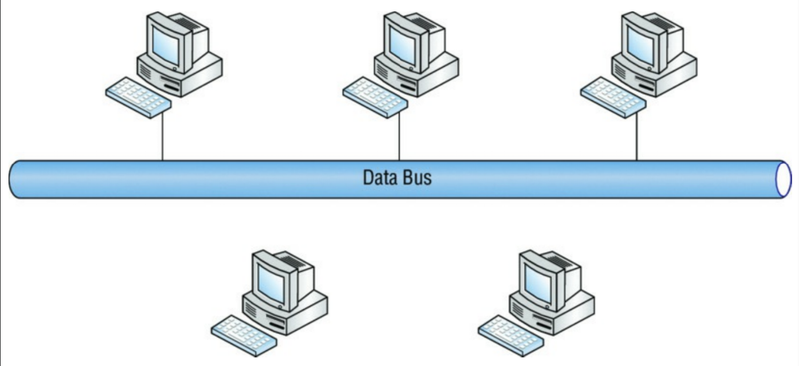
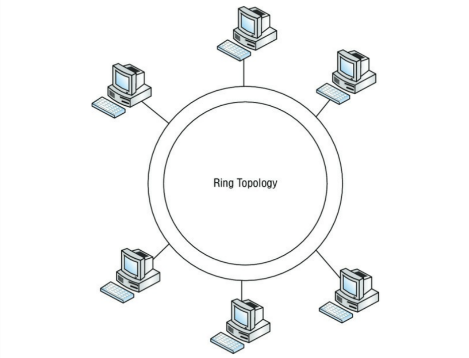
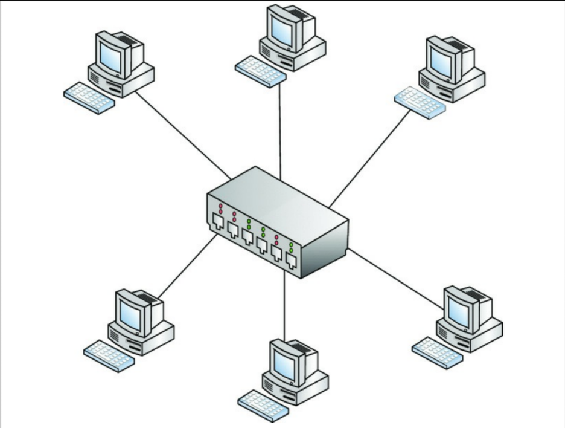
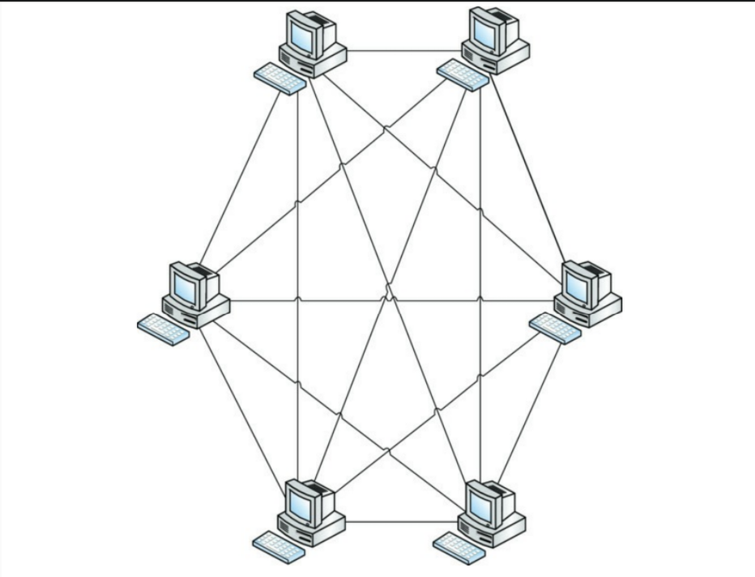
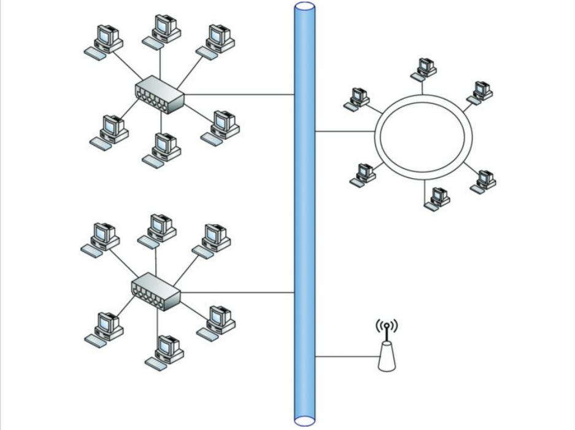

# بررسی توپولوژی‌های شبکه

چه یک کهنه‌کار باشید و چه یک تازه‌کار — یا حتی اگر فقط حافظه بدی دارید — مرور فناوری‌های شبکه مفید است و بخش مهمی از درک حملات و دفاع‌هایی است که بعداً بررسی خواهیم کرد.

توپولوژی‌های شبکه نمایانگر جنبه فیزیکی شبکه هستند و بخشی از زیربنای سیستم کلی ما را تشکیل می‌دهند. قبل از اینکه خیلی پیش برویم، اولین چیزی که باید درک کنید این است که در این بخش باید دو مفهوم متضاد اما مرتبط را در نظر بگیرید: **چیدمان فیزیکی شبکه** و **چیدمان منطقی شبکه**.

*   **چیدمان فیزیکی (Physical Layout):** مستقیماً به سیم‌کشی و کابل‌کشی که دستگاه‌ها را به هم متصل می‌کند، مربوط می‌شود. برخی از چیدمان‌های رایجی که پوشش خواهیم داد عبارتند از توپولوژی‌های باس (Bus)، حلقه (Ring)، ستاره (Star)، مش (Mesh) و ترکیبی (Hybrid).
*   **چیدمان منطقی (Logical Layout):** معادل متدولوژی دسترسی به شبکه است؛ چیزهایی که به راحتی نمی‌توانید ببینید یا لمس کنید، یا جریان اطلاعات و سایر داده‌ها.

ما به جنبه منطقی خواهیم رسید، اما ابتدا بیایید هر طراحی فیزیکی را بررسی کنیم.

## باس (Bus)

توپولوژی باس (شکل ۱) تمام گره‌های متصل را در یک مسیر واحد قرار می‌دهد که به عنوان ستون فقرات (Backbone) مشترک برای همه دستگاه‌های متصل عمل می‌کند. درست مانند حمل‌ونقل عمومی با همین نام، سیگنال‌ها سوار می‌شوند، به مقصد خود سفر می‌کنند و پیاده می‌شوند. باس پیوند مشترک بین تمام دستگاه‌ها و کابل‌هاست. نقطه ضعف سادگی آن، آسیب‌پذیری آن است؛ اگر ستون فقرات باس آسیب ببیند، تمام اتصالات قطع می‌شود. بهترین راه برای تصور این آسیب‌پذیری، فکر کردن به آن ریسه‌های چراغ کریسمس قدیمی است که وقتی یک چراغ می‌سوخت یا برداشته می‌شد، کل ریسه خاموش می‌شد. اگرچه امروزه به خالص‌ترین شکل آن در شبکه‌ها دیده نمی‌شود، اما مفهوم آن هنوز در بخش‌های خاصی کاربرد دارد.

    **شکل ۱:** توپولوژی باس

## حلقه (Ring)

توپولوژی‌های حلقه (شکل ۲) درست مانند چیدمان باس به نام خود وفادار هستند. اساساً ستون فقرات یا اتصال‌دهنده مشترک شبکه به صورت یک حلقه بسته شده است؛ برخی از چیدمان‌های حلقه از طراحی دایره متحدالمرکز برای ایجاد افزونگی (Redundancy) در صورت خرابی یک حلقه استفاده می‌کنند. هر کلاینت یا گره به حلقه متصل می‌شود و بسته‌ها را طبق نوبت تعیین‌شده یا در دسترس بودن توکن (Token) تحویل می‌دهد. همان‌طور که در شکل ۲ می‌بینید، طراحی دایره متحدالمرکز افزونگی ایجاد می‌کند؛ اگرچه ایده خوبی است، اما برای عملکرد صحیح شبکه وجود حلقه دومِ افزونه الزامی نیست. معماری حلقه افزونه معمولاً در تنظیماتی که از **FDDI** (Fiber Distributed Data Interface) استفاده می‌کنند، دیده می‌شود.

    **شکل ۲:** توپولوژی حلقه

## ستاره (Star)

چیدمان ستاره (شکل ۳) به دلیل سهولت راه‌اندازی و ایزوله کردن مشکلات اتصال در صورت بروز مسئله، یکی از رایج‌ترین توپولوژی‌هاست. توپولوژی ستاره چندین گره را به یک دستگاه شبکه مرکزی متصل می‌کند که شبکه را به هم پیوند می‌دهد. آن را شبیه به چرخ‌های یک گاری قدیمی یا چرخ‌های دوچرخه در نظر بگیرید. هاب (Hub) یا سوئیچ مرکز چرخ است و پره‌های چرخ، بازوهای ستاره هستند. مرکز می‌تواند یک هاب یا سوئیچ باشد؛ تا زمانی که به عنوان نقطه مرکزی اتصال عمل کند، شما یک توپولوژی ستاره دارید.

ستاره‌ها به دلایل متعددی محبوب هستند، اما بزرگترین دلیل آن مدت‌هاست که مقاومت آن در برابر قطعی بوده است. برخلاف گره‌ها در توپولوژی‌های باس و حلقه، یک گره منفرد در ستاره می‌تواند بدون تأثیر بر سایر گره‌ها آفلاین شود. با این حال، اگر هاب یا سوئیچی که همه چیز را به هم متصل می‌کند از کار بیفتد، کل شبکه از کار خواهد افتاد.

    **شکل ۳:** توپولوژی ستاره

## مش (Mesh)

توپولوژی مش (شکل ۴) اساساً تاری از کابل‌کشی است که گروهی از کلاینت‌ها یا گره‌ها را به یکدیگر متصل می‌کند. این می‌تواند کمی نامرتب و پیچیده به نظر برسد و عیب‌یابی را نیز بسیار دشوار کند. با این حال، این چیدمان اغلب برای سرویس‌های حیاتی (Mission-critical) به دلیل سطح بالای افزونگی و مقاومت در برابر قطعی استفاده می‌شود. بزرگترین شبکه جهان، اینترنت، که برای بقا در برابر حمله هسته‌ای طراحی شده بود، به عنوان یک شبکه مش بزرگ ساخته شده است.

    **شکل ۴:** توپولوژی مش

## ترکیبی (Hybrid)

توپولوژی‌های ترکیبی تا به امروز رایج‌ترین چیدمان مورد استفاده هستند. به ندرت با یک تنظیم خالص مواجه می‌شوید که دقیقاً از توپولوژی‌های ذکر شده در بالا پیروی کند. شبکه‌های امروزی ما پیچیده و چندوجهی هستند. اغلب اوقات، شبکه‌های فعلی حاصل بسیاری از اضافات و تغییرات در طول سال‌ها گسترش یا تغییرات لجستیکی هستند. یک چیدمان ترکیبی، توپولوژی‌های مختلف را در یک توپولوژی مخلوط ترکیب می‌کند؛ این چیدمان بهترین ویژگی‌های سایر طرح‌ها را می‌گیرد و به نفع خود استفاده می‌کند. شکل ۵ یک نمونه احتمالی را نشان می‌دهد.

    **شکل ۵:** توپولوژی ترکیبی

:::tip
روزهایی که یک مهاجم می‌توانست تنها با استفاده از «Vampire Taps» و دسترسی فیزیکی به کابل‌ها در چیدمان‌های باس یا دیگر چیدمان‌ها به جریان داده‌های شبکه دسترسی پیدا کند، گذشته است. امروزه، اکسس‌پوینت‌های بی‌سیم جعلی (Rogue Wireless Access Points)، یک گوشی هوشمند گم‌شده و کمی مهندسی اجتماعی می‌تواند به صورت منطقی هر هکری را مستقیماً از درِ جلو وارد کند، بدون اینکه واقعاً دسترسی فیزیکی به کابل‌ها داشته باشد.
:::
