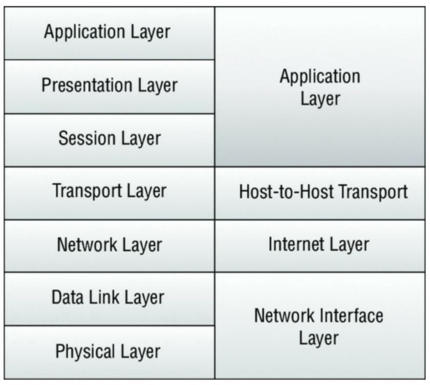

# کار با مدل Open Systems Interconnection (OSI)

هیچ بحث شبکه‌ای یا توضیح دستگاه شبکه‌ای بدون مروری مختصر بر مدل **OSI** (Open Systems Interconnection) کامل نخواهد بود. اگرچه این مدل ممکن است بیش از حد پیچیده به نظر برسد، اما همان‌طور که خواهید دید، در بحث‌های بعدی ما درباره حملات، دفاع‌ها و زیرساخت‌ها ارزشمند خواهد بود. مدل OSI چارچوبی کلی است که اجازه می‌دهد پروتکل‌های شبکه، نرم‌افزارها و سیستم‌ها بر اساس مجموعه‌ای از دستورالعمل‌های کلی طراحی شوند. دستورالعمل‌های مشترک امکان سازگاری سیستم و جریان منطقی ترافیک را با احتمال بیشتری فراهم می‌کنند. به عبارت دیگر، اگر همه ما طبق قوانین یکسانی بازی کنیم، همه با کمترین خطای ممکن با هم کنار خواهیم آمد.

مدل OSI، که در سمت چپ **شکل ۱** نشان داده شده است، دارای هفت لایه است. همان‌طور که عملکرد هر لایه را می‌خوانید، به خاطر داشته باشید که ما در حال بررسی چگونگی جریان یافتن داده‌ها هستیم. هر لایه به لایه بعدی متصل است؛ این مفهوم به عنوان مرجعی برای تحلیل داده‌های پیشرفته‌تر ارزشمند خواهد بود.

    **شکل ۱:** مدل مقایسه‌ای OSI و TCP/IP

:::tip
ممکن است قبلاً تجربه‌ای با مدل OSI داشته باشید یا اصلاً نداشته باشید. اگر در گروه دوم هستید، ممکن است از یادگیری این مدل اجتناب کرده باشید زیرا به نظر می‌رسد در عملیات روزمره شما کاربردی ندارد. اما باید آن را یاد بگیرید، زیرا برای پیشرفت شغلی شما — و برای قبولی در آزمون — ضروری است.
:::

:::tip
آزمون CEH بر درک شما از مدل OSI در ارتباط با حملات خاص تمرکز خواهد کرد. دانش عمومی از این مدل و مراحل جریان ترافیک در آن، به شما کمک می‌کند تا بفهمید هر سوال چه چیزی می‌پرسد. استفاده از مدل OSI به عنوان مرجع هنگام پاسخ دادن به سوالات می‌تواند به دسته‌بندی موضوع و تعیین فناوری‌هایی که با آن سر و کار دارید کمک کند.
:::

## لایه ۱: فیزیکی (Physical)

لایه فیزیکی شامل رسانه‌های فیزیکی و دستگاه‌های ساده‌ای (Dumb devices) است که زیرساخت شبکه‌های ما را تشکیل می‌دهند. این مربوط به کابل‌کشی و اتصالاتی مانند کابل‌های Category 5e و کانکتورهای RJ-45 است. توجه داشته باشید که این لایه شامل نور و امواج نیز می‌شود که به رسانه‌هایی مانند فیبر نوری و تجهیزات انتقال مایکروویو مربوط است. ملاحظات حمله در اینجا با امنیت فیزیکی منابع سایت هم‌راستا هستند. اگرچه پرزرق‌وتبرق نیست، اما امنیت فیزیکی همچنان در تست نفوذ (Pen testing) و سناریوهای دنیای واقعی نتایج زیادی به بار می‌آورد.

:::note
**استاکس‌نت (Stuxnet):** چند سال پیش کرم کوچک جالبی به نام استاکس‌نت در صحنه ظاهر شد که باعث ویرانی و نابودی تجهیزات صنعتی شد. عملکرد ویروس در اینجا مهم نیست؛ بخش جالب نحوه انتشار کرم بود. اگرچه در شبکه LAN محلی تکثیر می‌شد، اما آلودگی اولیه از طریق فلش درایوهای USB رخ داد. بردار اولیه در واقع ماهیت فیزیکی داشت و این بردار، کاربر ناآگاه یا شاید یک فرد خارجی بود. نتیجه اینکه: هرگز پیچیدگی آنچه را که می‌تواند از دیدگاه صرفاً فیزیکی رخ دهد، دست‌کم نگیرید.
:::

## لایه ۲: پیوند داده (Data Link)

لایه پیوند داده تلاش می‌کند تا اطمینان حاصل کند که داده‌های انتقالی بدون خطا هستند. در این لایه، داده‌ها در **فریم‌ها (Frames)** قرار می‌گیرند. عملکردهایی مانند کنترل دسترسی رسانه (MAC) و برقراری لینک در این لایه رخ می‌دهند. این لایه شامل پروتکل‌های پایه‌ای مانند ۸۰۲.۳ برای اترنت و ۸۰۲.۱۱ برای وای‌فای است.

## لایه ۳: شبکه (Network)

لایه شبکه مسیر بسته‌های داده (Data Packets) را بر اساس عوامل مختلفی که توسط پروتکل مورد استفاده تعریف شده است، تعیین می‌کند. در این لایه شاهد آدرس‌دهی IP برای مسیریابی بسته‌های داده هستیم. این لایه همچنین شامل پروتکل‌های مسیریابی مانند RIP (پروتکل اطلاعات مسیریابی) و IGRP (پروتکل مسیریابی دروازه داخلی) است. این لایه، لایه «بدانیم به کجا برویم» است.

## لایه ۴: انتقال (Transport)

لایه انتقال اطمینان حاصل می‌کند که انتقال یا ارسال داده‌ها موفقیت‌آمیز است. این عملکرد می‌تواند شامل عملیات بررسی خطا و همچنین تلاش برای حفظ توالی پیام‌های داده باشد. در این لایه پروتکل‌های **TCP** (پروتکل کنترل انتقال) و **UDP** (پروتکل دیتاگرام کاربر) را می‌یابیم.

## لایه ۵: جلسه (Session)

لایه جلسه، جلسات سیستمی برقرار شده بین نهادهای مختلف شبکه را شناسایی می‌کند. برای مثال، هنگامی که از راه دور به یک سیستم دسترسی پیدا می‌کنید، در حال ایجاد یک جلسه بین کامپیوتر خود و سیستم راه دور هستید. لایه جلسه چنین اتصالاتی را نظارت و کنترل می‌کند و اجازه می‌دهد چندین اتصال جداگانه به منابع مختلف برقرار شود. کاربرد رایج شامل NetBIOS و RPC است.

:::tip
با پیشروی در مطالب، متوجه خواهید شد که بخش بزرگی از سطح حمله ما در لایه‌های ۳، ۴ و ۵ قرار دارد و تعداد انگشت‌شماری از حملات دیگر در خارج از این لایه‌ها رخ می‌دهند. این موضوع را به عنوان مرجعی برای سوالات مربوط به حملات در لایه‌های خاص یا هنگام تلاش برای درک مکانیسم یک حمله و دفاع آن در ذهن داشته باشید. درک اینکه لایه چه کاری انجام می‌دهد می‌تواند به شما کمک کند تا تعیین کنید یک حمله خاص چگونه کار می‌کند و چه چیزی را هدف قرار می‌دهد.
:::

## لایه ۶: ارائه (Presentation)

لایه ارائه، ترجمه‌ای از داده‌ها را فراهم می‌کند که برای لایه دریافت‌کننده بعدی قابل درک باشد. جریان ترافیک در قالبی ارائه می‌شود که توسط گیرنده قابل مصرف باشد و می‌تواند به صورت اختیاری با پروتکل‌هایی مانند SSL رمزنگاری شود.

## لایه ۷: کاربرد (Application)

لایه کاربرد به عنوان یک پلتفرم کاربری عمل می‌کند که در آن کاربر و فرآیندهای نرم‌افزاری درون سیستم می‌توانند عمل کنند و به منابع شبکه دسترسی داشته باشند. برنامه‌ها و مجموعه‌های نرم‌افزاری که ما به صورت روزانه از آن‌ها استفاده می‌کنیم در این لایه قرار دارند. مثال‌های رایج شامل پروتکل‌هایی است که روزانه با آن‌ها تعامل داریم، مانند FTP و HTTP.

:::tip
دانستن توالی عملیاتی این لایه‌ها به عنوان یک ابزار عیب‌یابی سطح بالا بسیار مفید است. توانایی ردیابی ترافیک داده از بدو پیدایش تا مقصد، مهارتی مفید در طول کاوش‌های شما و در آزمون خواهد بود.
:::

استفاده از مدل OSI به عنوان یک چارچوب اساسی، مرجعی را برای شما فراهم می‌کند که در بسیاری از فرآیندهای CEH کاربرد دارد. حملات قابل استفاده همگی می‌توانند به یک لایه یا لایه‌های خاصی از مدل OSI ردیابی شوند.

