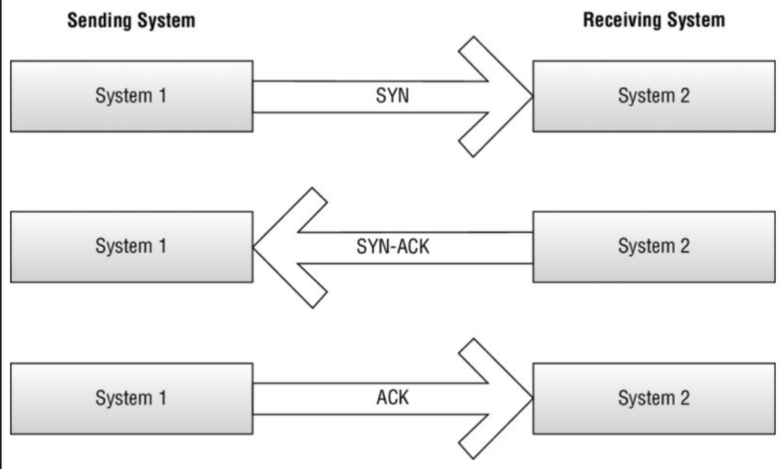
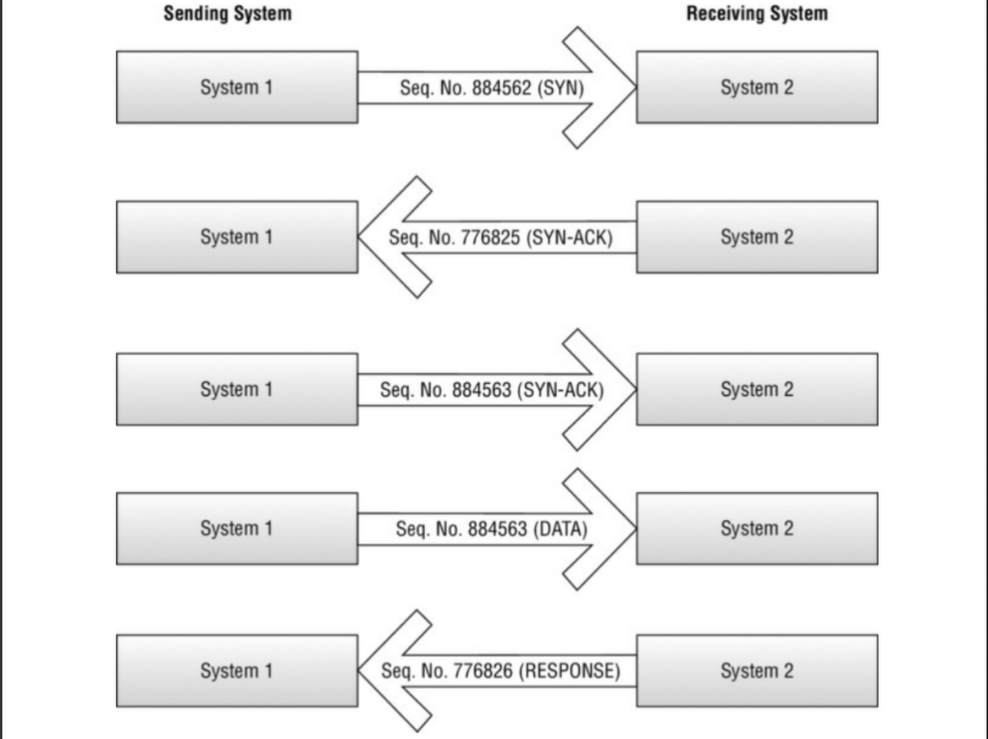

# بررسی TCP/IP

مکمل مدل OSI، مجموعه پروتکل **TCP/IP** است. TCP/IP لزوماً شاخه مستقیمی از مدل OSI نیست، اما گامی پیشرونده از نسخه استاندارد OSI برای جریان ترافیک است. هر لایه از مجموعه TCP/IP با یک یا چند لایه از مدل OSI نگاشت (Map) می‌شود. مجموعه TCP/IP برای مرجع پروتکل و همچنین کمک به ردیابی دقیق اینکه داده‌ها در کجای فرآیند جریان ترافیک هستند، مهم است. [سمت راست شکل ۱ (که قبلاً در بخش قبلی دیدید)](/docs/ceh/system_fundamentals/working_with_osi_model) لایه‌های مجموعه TCP/IP و نحوه نگاشت آن‌ها به مدل OSI را نشان می‌دهد.

پروتکل **TCP** به عنوان یک پروتکل اتصال‌گرا (Connection-oriented) شناخته می‌شود زیرا یک اتصال برقرار می‌کند و تایید می‌کند که بسته‌های ارسال شده از طریق آن اتصال به مقصد خود می‌رسند. این فرآیند (به شکل ۱ مراجعه کنید) با یک بسته **SYN** آغاز می‌شود. این بسته SYN با گفتن به سیستم گیرنده که سیستم دیگری خواهان توجه آن است (البته از طریق TCP)، فرآیند دست دادن (Handshake) را آغاز می‌کند. سپس سیستم گیرنده با یک پاسخ **SYN-ACK** به سیستم مبدأ پاسخ می‌دهد. پاسخ SYN-ACK یک پاسخ تایید (Acknowledgment) به بسته SYN اصلی است. هنگامی که فرستنده اصلی پاسخ SYN-ACK را دریافت کرد، به نوبه خود با یک بسته **ACK** پاسخ می‌دهد تا تایید کند که SYN-ACK را دریافت کرده و آماده برقراری ارتباط از طریق TCP است.

    **شکل ۱:** دست دادن سه‌مرحله‌ای TCP (Three-way handshake)

:::tip
**نکته آزمونی:** شماره‌های توالی (Sequence numbers) بسته TCP هم برای آزمون و هم برای درک حملاتی مانند Session Hijacking و MITM مهم هستند. بعداً در بخش مربوط به «ربودن جلسه» خواهید دید که این موضوع چگونه نقش ایفا می‌کند. فعلاً به خاطر داشته باشید که TCP چگونه کار می‌کند و چگونه از شماره‌های توالی و تایید برای تضمین تحویل داده‌ها استفاده می‌کند.
:::

برای توضیح بیشتر توالی، یک بسته SYN دارای یک **شماره توالی اولیه تصادفی** است که به میزبان هدف ارسال می‌شود. پس از دریافت بسته SYN، میزبان گیرنده با یک SYN-ACK پاسخ می‌دهد که دارای شماره توالی تصادفی خاص خود است. بسته پاسخ ACK از میزبان اول، شماره توالی را بر این اساس افزایش می‌دهد تا ترتیب بسته‌های در حال انتقال را نشان دهد. شکل ۲ شماره‌های توالی را نشان می‌دهد.

    **شکل ۲:** توالی TCP

:::tip
**نکته:** شما باید با TCP و فرآیند دست دادن سه‌مرحله‌ای آن راحت باشید. فرآیند سطحی آن نسبتاً آسان و قابل درک است. به شماره‌های توالی بسته‌ها توجه ویژه‌ای داشته باشید. آن‌ها قطعاً یکی از موارد آزمون خواهند بود.
:::