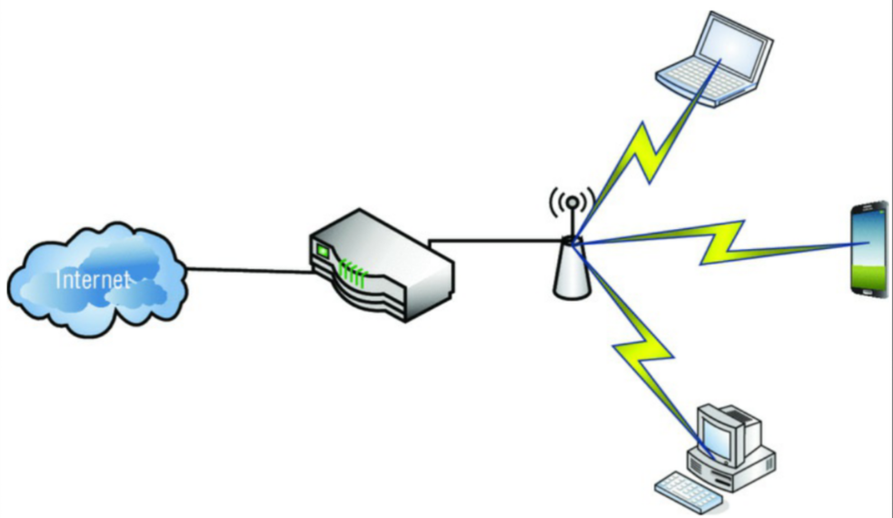
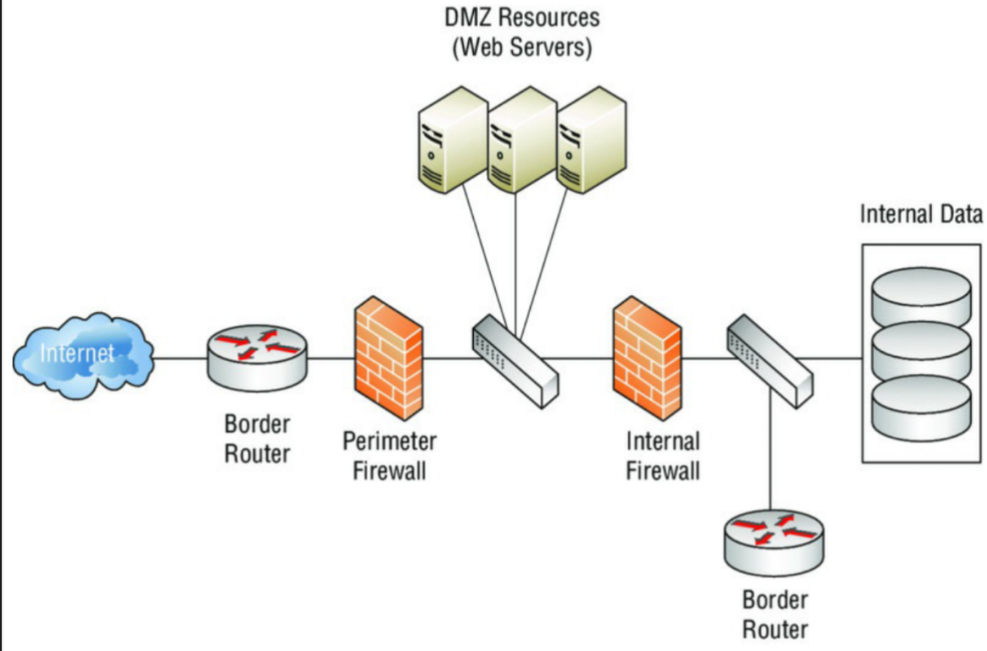

# امنیت شبکه

کتاب‌های زیادی به امنیت شبکه می‌پردازند، اما در اینجا ما بر روی آنچه هکرها می‌توانند استفاده کنند تمرکز می‌کنیم. فایروال‌ها و تجهیزات IDS/IPS بخشی از یک شبکه امن هستند، اما در این بخش به اختصار به محل قرارگیری و ارزش عملکردی هر دستگاه خواهیم پرداخت.

همان‌طور که در جزئیات پیش می‌روید، به خاطر داشته باشید که ایمن‌سازی یک شبکه فرآیندی **کلی‌نگر (Holistic)** است؛ از سوی دیگر، نفوذ به یک شبکه فرآیندی **متمرکز (Focused)** است. آن را شبیه به ساختن یک سد در نظر بگیرید. به عنوان مهندس یک سد، باید یکپارچگی کل سازه را در نظر بگیرید و بر اساس آن برنامه‌ریزی کنید. اگر به دنبال خرابکاری در سد هستید، تنها کافی است یک ضربه کوچک در جای درست بزنید تا همه چیز فرو بریزد. همین امر در مورد امنیت شبکه نیز صدق می‌کند.

با استفاده از دانش بنیادی خود در مورد فایروال‌ها، چه پروکسی و چه شبکه، بیایید به برخی استراتژی‌های اساسی محل قرارگیری که معمولاً در شبکه‌های امروزی استفاده می‌شوند، نگاهی بیندازیم.

**شکل ۱** یک تنظیم اولیه است که امروز تقریباً در هر خانه‌ای با آن روبرو خواهید شد. البته این لزوماً شبکه سطح سازمانی (Enterprise) نیست که شما به آن حمله خواهید کرد، اما این چیدمان اولیه همچنان شامل اجزای نقاط آسیب‌پذیر طرح‌های بزرگتر است. هدف از گنجاندن این طرح این است که به شما ایده‌ای بدهیم که چقدر به شبکه بزرگتر ما شباهت دارد.

    **شکل ۱:** تنظیم شبکه مسکونی

:::note آسیب‌پذیری در یک سازمان
حتی در ایمن‌ترین تأسیسات نیز خطر به خطر افتادن امنیت شبکه توسط دستگاه‌های جعلی (Rogue Devices) وجود دارد. این اساساً یک محیط ریسک مسکونی را در یک شبکه سطح سازمانی ایجاد می‌کند. البته، ریسک‌ها و از دست دادن احتمالی منابع بسیار بالاتر است، اما پویایی ریسک یکسان است.

برای مثال، زمانی که من به عنوان مدیر شبکه در یکی از موقعیت‌های فدرال خود کار می‌کردم، کل تأسیسات را با درهای کارتی، احراز هویت دو عاملی و امنیت پیرامونی قابل احترام ساختمان ایمن کرده بودیم. تنها یک **اکسس‌پوینت بی‌سیم جعلی (Rogue Wireless Access Point)** کافی بود تا تمام تلاش امنیت شبکه ما را به چیزی در حد یک دستگاه ارزان‌قیمت فروشگاهی تقلیل دهد. شوخی به کنار، این تنها یک مثال ساده از آسیب‌پذیری ناخواسته اما مفیدی است که رایج‌تر از آن است که بتوانید تصور کنید.
:::

اکنون که از آسیب‌پذیری‌های اولیه تنظیمات بی‌سیم خانگی خود عبور کردیم، بیایید مستقیماً وارد یک مثال کامل سازمانی شویم. محیط سازمانی که ما وظیفه تست نفوذ آن را بر عهده خواهیم داشت، شبیه به محیطی است که در **شکل ۲** نشان داده شده است.

    **شکل ۲:** شبکه معمولی سازمانی

همان‌طور که می‌بینید، لایه‌های حفاظتی وجود دارد تا بازدیدکنندگان غیرمجاز را از پرسه زدن در شبکه داخلی بازدارد. یک **دفاع لایه‌ای (Layered Defense)** سطوح (لایه‌های) متعددی از موانع دفاعی را اعمال می‌کند به این امید که هکر در میانه راه گیر بیفتد. همه سازمان‌ها بودجه لازم برای نصب چنین راهکاری را ندارند و پرسنلی را در اختیار ندارند که به درستی آموزش دیده باشند تا به‌روز بمانند و تجهیزات حفاظتی را به درستی پیکربندی کنند. یک فایروال ۱۰,۰۰۰ دلاری تنها به اندازه مدیری که آن را نگهداری می‌کند، خوب است. علاوه بر این، به عنوان هکرهای قانونمند، ما می‌توانیم بر متغیر شگفت‌انگیزی برای ایجاد آسیب‌پذیری تکیه کنیم: **کاربران عزیزمان.**
