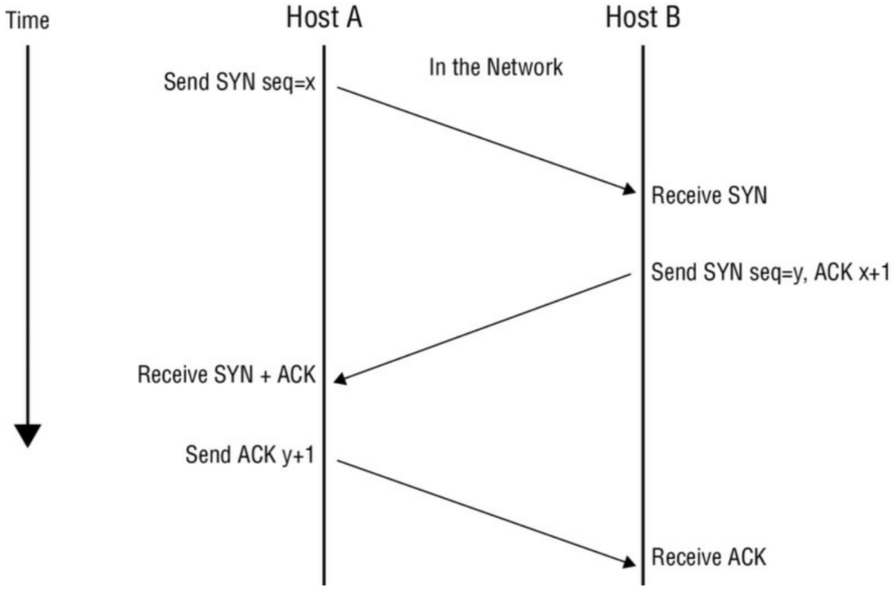

# بررسی وضعیت پورت‌ها

هنگامی که سیستم‌های زنده را در یک شبکه پیدا کردید، زمان آن است که نگاه دقیق‌تری به این میزبان‌ها بیندازید تا مشخص کنید آیا پورت بازی وجود دارد که ممکن است مفید باشد یا خیر. اساساً کاری که ما هنگام زوم کردن روی هر میزبان زنده انجام می‌دهیم این است که «دستگیره درها را می‌لرزانیم» تا ببینیم کدام پورت‌ها باز و کدام بسته هستند. و در حالی که ممکن است ببینیم کدام باز و بسته هستند، هنوز در نقطه‌ای نیستیم که «دستگیره را بچرخانیم و به داخل نگاه کنیم»؛ آن مرحله هنوز پیش رو است.

:::note اهمیت اسکن پورت
شما باید بدانید اسکن‌های پورت چگونه کار می‌کنند و انواع مختلف اسکن‌های موجود چیست و همچنین چرا باید از یک نوع نسبت به نوع دیگر استفاده کنید. به اسکن‌های ذکر شده در اینجا توجه دقیق داشته باشید زیرا هر کدام جزئیات کوچکی دارند که ممکن است نادیده بگیرید. همچنین به یاد داشته باشید که این اسکن‌ها را مطالعه، مطالعه و مطالعه کنید.
:::

قبل از اینکه شروع به انجام برخی اسکن‌های پورت کنیم، بیایید لحظه‌ای وقت بگذاریم تا برخی مبانی را مرور کنیم. در بخش ۲ شما درباره TCP و UDP و زمینه آن‌ها در مجموعه پروتکل‌های TCP/IP یاد گرفتید. اگر به خاطر داشته باشید، TCP یک پروتکل اتصال‌گرا و UDP ذاتاً بدون اتصال است. دانستن اینکه این پروتکل‌ها چگونه عمل می‌کنند و اهمیت هر کدام، تنظیم دقیق و انتخاب اسکن صحیح را برای شما بسیار آسان‌تر و قطعاً پربارتر می‌کند.

کار را با فرآیندی که منحصراً توسط TCP استفاده می‌شود و به عنوان **دست دادن سه‌مرحله‌ای (Three-way handshake)** شناخته می‌شود، شروع می‌کنیم.

دست دادن سه‌مرحله‌ای زمانی انجام می‌شود که می‌خواهید یک اتصال TCP به یک سیستم یا به طور خاص، یک پورت روی سیستم برقرار کنید. این دست دادن یک اتصال موفق و قابل اعتماد بین دو سیستم ایجاد می‌کند. این فرآیند شامل سه مرحله است، همان‌طور که در **شکل ۱** نشان داده شده است.

    **شکل ۱:** دست دادن سه‌مرحله‌ای

بیایید نگاهی دقیق‌تر به مراحل بیندازیم تا ببینیم چه اتفاقی می‌افتد:

1.  **میزبان A** یک بسته **SYN** به میزبان B ارسال می‌کند به عنوان درخواستی برای برقراری ارتباط.
2.  **میزبان B** با یک **SYN-ACK** به عنوان تایید درخواست پاسخ می‌دهد.
3.  **میزبان A** با یک **ACK** پاسخ می‌دهد که برای برقراری کامل اتصال عمل می‌کند.

اگر این مراحل بدون خطا کامل شوند، آنگاه اتصال TCP با موفقیت برقرار شده و جریان اطلاعات می‌تواند رخ دهد.

اگر به شکل ۱ و مراحل ذکر شده توجه دقیق کرده باشید، متوجه گنجاندن مواردی شبیه به کلمات اختصاری در قالب SYN و ACK شده‌اید. SYN و ACK دو مورد از نشانگرهای روی بسته هستند که به عنوان **پرچم‌ها (Flags)** شناخته می‌شوند. این پرچم‌ها اساساً بیت‌هایی هستند که در هدر بسته TCP روی روشن (On) یا خاموش (Off) تنظیم می‌شوند. سیستم گیرنده از این پرچم‌ها استفاده می‌کند تا تعیین کند چگونه آن بسته خاص را پردازش کند. در یک بسته TCP ممکن است هر پرچم روشن یا هر پرچم خاموش باشد، و هر نوع ترکیبی از روشن و خاموش در اکثر موارد مجاز است. این اطلاعات پایه از این لحظه به بعد برای شما حیاتی است زیرا تأثیر مستقیمی بر مفید بودن فرآیند اسکن شما خواهد داشت. **جدول ۱** پرچم‌های TCP را توضیح می‌دهد.

**جدول ۱: پرچم‌های TCP**
| پرچم (Flag) | کاربرد |
| :---: | ---: |
| **SYN** | آغاز یک اتصال بین دو میزبان برای تسهیل ارتباط. |
| **ACK** | تایید دریافت یک بسته اطلاعات. |
| **URG** | نشان می‌دهد که داده‌های موجود در بسته فوری هستند و باید فوراً پردازش شوند. |
| **PSH** | به سیستم فرستنده دستور می‌دهد تمام داده‌های بافر شده را فوراً ارسال کند. |
| **FIN** | به سیستم راه دور می‌گوید که اطلاعات دیگری ارسال نخواهد شد. در اصل، این کار یک اتصال را به زیبایی می‌بندد. |
| **RST** | یک اتصال را بازنشانی (Reset) می‌کند. |

:::tip
این پرچم‌ها در این بخش و همچنین در آزمون CEH در چندین حوزه مانند شنود و سیستم‌های تشخیص نفوذ نقش برجسته‌ای خواهند داشت. هر یک از آن‌ها را مطالعه و حفظ کنید.
:::

این اطلاعات می‌تواند در بسیاری از حوزه‌ها مفید باشد، به خصوص زمانی که از یک **سازنده بسته (Packet Crafter)** استفاده می‌کنید. سازنده بسته ابزاری است که برای ایجاد یک بسته با پرچم‌هایی که شما مشخص می‌کنید (روشن یا خاموش) طراحی شده است. می‌توانید از آن برای ایجاد بسته‌های سفارشی با پرچم‌های تنظیم شده به روش‌های مختلف استفاده کنید تا مشاهده نمایید یک سیستم هدف چگونه به بسته پاسخ می‌دهد و چه نوع نتایجی بازگردانده می‌شود.

در میان ساده‌ترین ابزارهایی که می‌توانید استفاده کنید **hping2** و **hping3** هستند. هر دوی این ابزارها فقط خط فرمان هستند و مزیت فوق‌العاده‌ای در ایجاد بسته‌های سفارشی برای تست ارائه می‌دهند. با استفاده از hping3، برای مثال، می‌توان انواع مختلفی از بسته‌ها را تولید و به یک هدف ارسال کرد:

ایجاد یک بسته ACK و ارسال آن به پورت ۸۰ روی قربانی:

    `hping3 –A <target IP address> -p 80`

ایجاد یک اسکن SYN علیه پورت‌های مختلف روی یک قربانی:

    `hping3 -8 50-56 –s <target IP address> -v`

ایجاد یک بسته با پرچم‌های FIN، URG و PSH تنظیم شده و ارسال آن به پورت ۸۰ روی قربانی:

    `hping3 –F –P -U <target IP address> -p 80`

