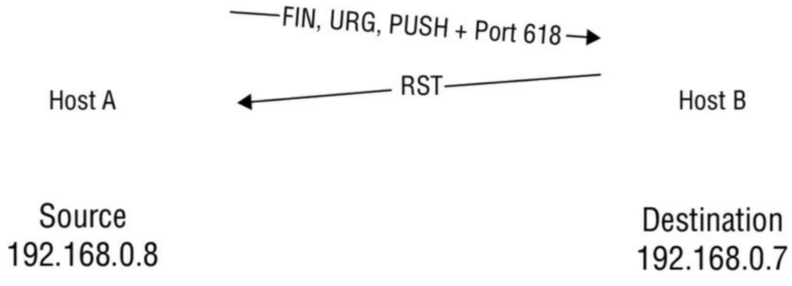
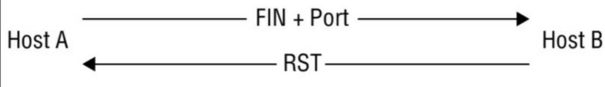
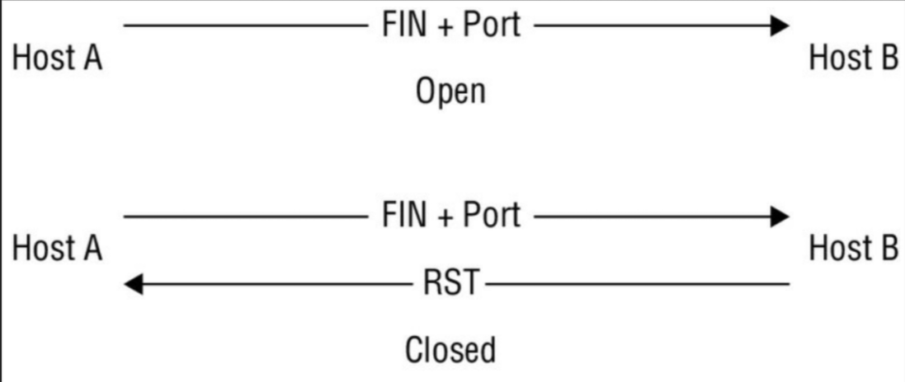

# انواع اسکن‌ها

با در دست داشتن درک خوب و امیدواریم محکمی از پرچم‌ها و اهمیت آن‌ها، اکنون می‌توانیم به سمت تحلیل و امتحان برخی از انواع مختلف اسکن‌ها حرکت کنیم. حالا که انواع مختلف پرچم‌ها و نحوه کار یک سازنده بسته (Packet Crafter) در قالب hping2 و hping3 را دیده‌اید، بیایید ببینیم این اطلاعات چگونه کنار هم می‌آیند.

## اسکن تمام-باز (Full-Open Scan)

اولین نوع اسکن به عنوان اسکن تمام-باز شناخته می‌شود، که راهی تجملی برای گفتن این است که سیستم‌های درگیر دست دادن سه‌مرحله‌ای را آغاز و تکمیل کرده‌اند. مزیت یک اسکن تمام-باز این است که شما بازخورد مثبتی دریافت می‌کنید که میزبان زنده است و اتصال کامل است. در بسیاری از موارد، تست‌کنندگان نفوذ تازه‌کار عمداً یا تصادفی اقدام به انجام یک اسکن تمام-باز علیه یک هدف می‌کنند؛ این می‌تواند بد و حتی برای تست شما کشنده باشد زیرا می‌تواند توسط فایروال‌ها و IDS شناسایی و ثبت (Log) شود.

این فرآیند برای پورت‌های باز دست دادن را کامل می‌کند، اما برای پورت‌های بسته چه می‌کند؟ هنگامی که با یک پورت بسته مواجه می‌شود، طرف فرستنده یک بسته **ACK** به پورت خاصی در میزبان راه دور ارسال می‌کند؛ وقتی این درخواست با پورت بسته مواجه می‌شود، یک **RST** بازگردانده می‌شود که تلاش را خاتمه می‌دهد.

برای انجام یک اسکن تمام-باز باید انتخاب کنید که یک اسکن اتصال TCP (TCP Connect Scan) را با استفاده از سوئیچ `sT-` انجام دهید، جایی که `s-` نشان‌دهنده اسکن و `T` بزرگ بیانگر این است که نوع اسکن اتصال TCP است.

دستور اجرای این نوع اسکن به این صورت است:
    

        `nmap –sT <ip address or range>`
    

وقتی این دستور اجرا می‌شود، میزبان اسکن شده و گزارشی بازگردانده می‌شود. به خاطر داشته باشید که وقتی این نوع اسکن را انجام می‌دهید، بسیار **«پرسروصدا» (Noisy)** است و در لاگ‌ها ظاهر می‌شود و منتظر کشف شدن می‌ماند. از این اسکن فقط زمانی استفاده کنید که هیچ اسکن دیگری کار نمی‌کند یا مناسب نیست.

## اسکن مخفی یا نیمه‌باز (Stealth or Half-Open Scan)

در این نوع اسکن، فرآیند مشابه اسکن تمام-باز است با یک تفاوت عمده: این اسکن کمتر از اسکن تمام-باز پرسروصدا است. بنابراین، این نوع اسکن گاهی اوقات به عنوان اسکن مخفی یا با نام پرکاربرد **اسکن SYN** شناخته می‌شود.

یک اسکن نیمه‌باز با همان فرآیند اسکن تمام-باز تا انتها پیش می‌رود، جایی که در مورد مرحله نهایی دست دادن سه‌مرحله‌ای متفاوت عمل می‌کند. در حالی که اسکن تمام-باز دست دادن سه‌مرحله‌ای را با یک پیام ACK نهایی در پاسخ به SYN-ACK تکمیل می‌کند، اسکن نیمه‌باز این کار را نمی‌کند. در یک اسکن نیمه‌باز، سیستم اسکن‌کننده با یک پیام **RST** به پیام SYN-ACK پاسخ می‌دهد. این کار باعث می‌شود به هدف اطلاع داده شود که طرف درخواست‌کننده نمی‌خواهد اتصالی برقرار کند. نتیجه این است که چیزهای بسیار کمتری برای ثبت در لاگ وجود دارد و از آنجا که بسته ACK نهایی هرگز ارسال نشد، پورت باز همچنان تایید شده است، اما هیچ اتصال فعالی ایجاد نشده است.

با این حال، اگر پورتی بسته باشد نه باز، دست دادن سه‌مرحله‌ای با ارسال یک SYN توسط مهاجم شروع می‌شود، اما قربانی با یک بسته RST پاسخ می‌دهد که نشان می‌دهد پورت بسته است و اتصالات را نمی‌پذیرد. **شکل ۱** این تکنیک اسکن را برای پورت‌های باز و بسته نشان می‌دهد.

    **شکل ۱:** اسکن نیمه‌باز علیه پورت‌های بسته و باز

همان‌طور که قبلاً گفته شد، مزیت اصلی این نوع خاص از اسکن این است که احتمال کمتری دارد مکانیسم‌های تشخیص را فعال کند یا در لاگ‌ها ثبت شود، اما نقطه ضعف آن این است که کمی کمتر از اسکن تمام-باز قابل اعتماد است، زیرا به دلیل عدم وجود ACK نهایی، تاییدیه‌ای در طول این فرآیند دریافت نمی‌شود.

برای انجام این نوع اسکن در nmap از نحو زیر استفاده کنید:
    

        `nmap –sS <ip address or range>`
    

## اسکن درخت کریسمس

این اسکن بعدی نام خود را از عبارت «مانند درخت کریسمس روشن شده» می‌گیرد، به این معنی که پرچم‌های متعددی تنظیم شده‌اند. در این نوع اسکن، چندین پرچم فعال می‌شوند. به عبارت دیگر، یک بسته واحد با پرچم‌های **URG**، **PSH** و **FIN** که همگی روی روشن تنظیم شده‌اند، به کلاینت ارسال می‌شود.

تنظیم بودن تمام پرچم‌ها ترکیبی غیرمنطقی یا غیرقانونی ایجاد می‌کند و سیستم گیرنده باید تعیین کند که وقتی این اتفاق می‌افتد چه کاری انجام دهد. در اکثر سیستم‌های مدرن این به سادگی به این معنی است که بسته نادیده گرفته یا رها می‌شود، اما در برخی سیستم‌ها عدم پاسخ به شما می‌گوید پورت باز است، در حالی که یک بسته RST به شما می‌گوید پورت بسته است. **شکل ۲** این فرآیند را نشان می‌دهد.

    **شکل ۲:** اسکن درخت کریسمس

برای انجام یک اسکن درخت کریسمس با nmap، دستور زیر را در خط فرمان وارد کنید:
    

        `nmap –sX –v <target IP address>`
    

پس چرا سیستم‌ها اگر پورت باز باشد به بسته‌های درخت کریسمس پاسخ نمی‌دهند اما اگر بسته باشد پاسخ می‌دهند؟ از آنجا که ترکیب پرچم‌ها اساساً ساختگی است، واقعاً پاسخ مناسبی وجود ندارد. با این حال، در مورد پورت بسته، تلاش برای اتصال همچنان فقط یک تلاش است و بنابراین پورت بسته پاسخ می‌دهد تا نشان دهد اتصالات از هر نوعی مجاز نیستند.

یک نکته که باید در مورد اسکن‌های درخت کریسمس به خاطر داشته باشید این است که آن‌ها همیشه پاسخ یکسانی را از تمام اهداف برنمی‌انگیزند. پاسخ می‌تواند کمی یا زیاد از سیستم‌عاملی به سیستم‌عامل دیگر متفاوت باشد. علت این تفاوت این است که توسعه‌دهندگان سیستم‌عامل‌ها و دستگاه‌ها همیشه دقیقاً به استاندارد پروتکل اینترنت (RFC 791 یا 793) که رفتار مورد انتظار پروتکل را تعریف می‌کند، پایبند نیستند. از آنجا که بسیاری از فروشندگان تصمیم می‌گیرند تفسیر خود را اینجا و آنجا کمی تنظیم کنند، پاسخ‌ها در تحلیل دقیق می‌توانند متفاوت باشند. مزیت این امر این است که می‌تواند سیستم‌عامل خاص مورد استفاده در سیستم هدف را آشکار کند.

علاوه بر این، نشانه‌ای که این نوع اسکن سیستم‌های شما را هدف قرار داده است این است که قدرت پردازش بیشتری از طرف هدف مصرف می‌کند. ناگفته نماند که نه‌تنها افزایش قدرت پردازش نشان می‌دهد که چیزی اشتباه است، بلکه این واقعیت که بسته‌ها نباید در شرایط عادی وجود داشته باشند، آن‌ها را مشکوک می‌کند.

:::note
نسخه‌های فعلی ویندوز (معمولاً ویندوز XP یا بالاتر) به این نوع حمله پاسخ نمی‌دهند.
:::

## اسکن FIN

در این نوع اسکن، مهاجم بسته‌هایی با پرچم **FIN** تنظیم شده به قربانی ارسال می‌کند. مفهوم پشت این نوع اسکن این است که اسکن‌های SYN هنوز بسیار قابل مشاهده هستند (هرچند نه به اندازه اسکن‌های اتصال TCP)؛ برای به دست آوردن پروفایل پایین‌تر، می‌توان از بسته‌ای با پرچم FIN استفاده کرد. این نوع تکنیک اسکن نه‌تنها به این دلیل مؤثر است که کمتر آشکار است، بلکه به این دلیل که می‌تواند با اطمینان از فایروال‌ها بدون تغییر عبور کند و مستقیماً به سمت هدف مورد نظر برود. از سوی دیگر، بسته‌های SYN وقتی با فایروال مواجه می‌شوند احتمالاً سطوح بالاتری از بررسی دقیق را دریافت می‌کنند.

نتیجه تا حدودی شبیه به آنچه در اسکن درخت کریسمس اتفاق می‌افتد است. پاسخ قربانی بستگی به باز یا بسته بودن پورت دارد. بسیار شبیه به اسکن درخت کریسمس، اگر یک FIN به پورت باز ارسال شود، پاسخی وجود ندارد، اما اگر پورت بسته باشد، قربانی یک RST بازمی‌گرداند. **شکل ۳** این فرآیند را نشان می‌دهد.

    **شکل ۳:** اسکن FIN علیه پورت بسته و پورت باز

یک اسکن FIN در nmap می‌تواند با صدور دستور زیر انجام شود:
    

        `nmap –sF <target IP address>`
    

:::tip الگوی Nmap
امیدوارم تا الان کم‌کم الگویی در نحوه کار nmap ببینید. به طور خاص، بیایید روی سوئیچ `s-` تمرکز کنیم. این سوئیچ برای تعریف نوع اسکنی که استفاده می‌شود به کار می‌رود. تا کنون انواع اسکن عبارت بوده‌اند از تمام-باز (`sT-`)، نیمه‌باز (`sS-`)، درخت کریسمس (`sX-`) و اکنون اسکن‌های FIN (`sF-`). توجه کنید که چگونه هر نوع اسکن تمایل دارد از یک حرف بزرگ استفاده کند که به نوع اسکن اشاره دارد. این را برای زمان آزمون به خاطر بسپارید؛ یادآوری اطلاعات را برایتان آسان‌تر می‌کند.
:::

## اسکن NULL

در این نوع اسکن، مهاجم فریم‌هایی را بدون تنظیم هیچ پرچمی به قربانی ارسال می‌کند. نتیجه تا حدودی شبیه به آنچه در اسکن FIN اتفاق می‌افتد است. پاسخ قربانی بستگی به باز یا بسته بودن پورت دارد. بسیار شبیه به اسکن‌های FIN و درخت کریسمس، اگر هیچ پرچمی روی فریمی که به پورت باز ارسال می‌شود تنظیم نشده باشد، پاسخی وجود ندارد، اما اگر پورت بسته باشد، قربانی یک RST بازمی‌گرداند. **شکل ۴** این فرآیند را نشان می‌دهد.

    **شکل ۴:** اسکن NULL علیه پورت بسته و پورت باز

در nmap، برای انجام اسکن NULL دستور زیر را صادر کنید:
    

       `nmap –sN <target IP address>`
    

در عمل، زمانی که این اسکن در حال انجام است، تشخیص آن نسبتاً آسان است. این سهولت تشخیص عمدتاً به این دلیل است که هیچ دلیلی برای وجود یک بسته TCP بدون هیچ پرچم تنظیم شده‌ای در شبکه وجود ندارد. بسته‌های TCP نیاز دارند پرچم‌هایی تنظیم شده باشند تا گیرنده تعیین کند با اطلاعات دریافتی چه کند. تنها کاری که یک مدافع باید انجام دهد تا متوجه اجرای این نوع اسکن شود، این است که اقدامات متقابل خود را طوری پیکربندی کند که هنگام مواجهه با چنین بسته‌ای به او اطلاع دهد.

## اسکن Idle

یک نوع اسکن که منحصر‌به‌فرد و بسیار قدرتمند است به عنوان **اسکن بیکار** شناخته می‌شود. این نوع اسکن به دلیل درجه بالای مخفی‌کاری در مقایسه با سایر اسکن‌ها مؤثر است. روشی که این قابلیت را برای حفظ چنین پروفایل پایینی به دست می‌آورد، ناشی از نحوه انجام اسکن است.

اسکن بیکار به دلیل توانایی پنهان کردن هویت طرف مهاجم با ارسال نکردن بسته‌ها از سیستم واقعی مهاجم شناخته می‌شود. در عمل این فرآیند با پرش دادن (Bouncing) اسکن از روی میزبان دیگری (که معمولاً **زامبی** نامیده می‌شود) و سپس به سمت هدف انجام می‌شود. اگر قربانی اسکن، فعالیت ایجاد شده توسط فرآیند را بررسی کند، اسکن را نه به مهاجم واقعی بلکه به سیستم زامبی ردیابی خواهد کرد. علاوه بر فوق‌العاده مخفی‌کار بودن، این اسکن امکان کشف روابط اعتماد مبتنی بر IP بین ماشین‌ها را فراهم می‌کند.

اگرچه اسکن بیکار بسیار پیچیده‌تر از هر یک از تکنیک‌های اسکن معرفی شده قبلی است، اما درک آن در عمل فوق‌العاده دشوار نیست. این اسکن به سه نکته اساسی بستگی دارد:

1.  یک راه برای تعیین باز بودن پورت TCP ارسال یک بسته SYN به پورت است. ماشین هدف اگر پورت باز باشد با SYN/ACK و اگر بسته باشد با RST پاسخ می‌دهد.
2.  ماشینی که بسته SYN/ACK ناخواسته‌ای دریافت کند با RST پاسخ می‌دهد. یک RST ناخواسته نادیده گرفته می‌شود.
3.  هر بسته IP در اینترنت دارای یک شماره شناسایی قطعه (**IP ID**) است. از آنجا که بسیاری از سیستم‌عامل‌ها این عدد را برای هر بسته‌ای که ارسال می‌کنند یکی اضافه می‌کنند، کاوش برای IP ID می‌تواند به مهاجم بگوید که از زمان آخرین کاوش چند بسته ارسال شده است.

از طریق اعمال و ترکیب این ویژگی‌هاست که طرف مهاجم می‌تواند هویت خود را جعل (Spoof) کند و تقصیر را گردن سیستم دیگری بیندازد که در این مورد زامبی است. برای یک ناظر بیرونی، زامبی شبیه به منشأ حمله به نظر می‌رسد.

**تجزیه و تحلیل:**
یک اسکن بیکار شامل سه مرحله است که برای هر پورتی که قرار است اسکن شود تکرار می‌شود:

1.  IP ID زامبی را کاوش و ثبت کنید.
2.  یک بسته SYN جعلی از طرف زامبی بسازید و به پورت مورد نظر روی هدف ارسال کنید. بسته به وضعیت پورت، واکنش هدف ممکن است باعث افزایش IP ID زامبی شود یا نشود.
3.  دوباره IP ID زامبی را کاوش کنید. سپس وضعیت پورت هدف با مقایسه این IP ID جدید با آنچه در مرحله ۱ ثبت شده تعیین می‌شود.

پس از این فرآیند، IP ID زامبی باید به اندازه یک یا دو واحد افزایش یافته باشد. افزایش یک واحد نشان می‌دهد که زامبی هیچ بسته‌ای ارسال نکرده است، به جز پاسخ به کاوش مهاجم. این عدم ارسال بسته به این معنی است که پورت باز نیست (هدف باید یا بسته RST به زامبی فرستاده باشد که نادیده گرفته شده، یا اصلاً چیزی نفرستاده). افزایش دو واحدی نشان می‌دهد که زامبی بین دو کاوش یک بسته ارسال کرده است. این بسته اضافی معمولاً به این معنی است که پورت باز است (هدف احتمالاً یک بسته SYN/ACK در پاسخ به SYN جعلی به زامبی فرستاده که باعث ایجاد بسته RST از طرف زامبی شده است). افزایش‌های بزرگتر از دو معمولاً نشان‌دهنده یک میزبان زامبی بد است. ممکن است شماره‌های IP ID قابل پیش‌بینی نداشته باشد یا درگیر ارتباطاتی نامرتبط با اسکن بیکار باشد.

حتی با اینکه آنچه با پورت بسته اتفاق می‌افتد کمی با آنچه با پورت فیلتر شده اتفاق می‌افتد متفاوت است، مهاجم نتیجه یکسانی را در هر دو مورد اندازه می‌گیرد، یعنی افزایش IP ID به اندازه یک. بنابراین، برای اسکن بیکار تمایز بین پورت‌های بسته و فیلتر شده ممکن نیست. وقتی nmap افزایش IP ID یک واحدی را ثبت می‌کند، پورت را `closed|filtered` علامت‌گذاری می‌کند.

:::tip مزایا و معایب
اسکن‌های بیکار ابزاری فوق‌العاده برای افزودن به زرادخانه شما هستند، اما به خاطر داشته باشید که با هر ابزار و تکنیکی مزایا و معایبی وجود دارد. در مورد اسکن‌های بیکار، یکی از مزایا این است که این نوع اسکن در فرار از تشخیص توسط IDS و برخی فایروال‌ها مؤثر است. یک نقطه ضعف این است که اسکن نسبت به گزینه‌های دیگر زمان بیشتری می‌برد. در مورد اسکن‌های بیکار می‌توانید انتظار داشته باشید که مدت زمان اسکن به طور قابل توجهی افزایش یابد.
:::

## اسکن ACK

تا این لحظه اشاره کردیم که برخی اسکن‌ها می‌توانند شناسایی یا حتی مسدود شوند، پس اگر با وضعیتی مواجه شدید که این اتفاق می‌افتد چه باید بکنید؟ ابتدا به مسئله مسدود شدن نگاه خواهیم کرد.

در بسیاری از موارد وقتی اسکن از رسیدن به هدف مسدود می‌شود، ممکن است فایروالی وجود داشته باشد و آن هم از نوع خاصی. اگر فایروالی مانع اسکن‌های شما می‌شود (مانند مواردی که در اینجا ذکر شد)، به طور کلی نشان‌دهنده حضور یک **فایروال حالت‌دار (Stateful Firewall)** است.

فایروال‌های حالت‌دار — و آن‌هایی که بازرسی بسته حالت‌دار (SPI) انجام می‌دهند — آن‌هایی هستند که وضعیت تمام اتصالات شبکه عبوری از دستگاه را ردیابی می‌کنند. فایروال طراحی شده است تا تفاوت بین اتصالات مشروع و نامشروع را تشخیص دهد. هر بسته‌ای که با یک اتصال فعال شناخته شده مطابقت نداشته باشد، دور ریخته می‌شود، در حالی که آن‌هایی که مطابقت دارند اجازه عبور می‌یابند.

اسکن ACK برای تست وجود SPI بر اساس نحوه عملکرد پرچم‌ها و SPI طراحی شده است. در عملکرد عادی، یک بسته ACK تنها در پاسخ به یک اتصال در حال برقراری یا در پاسخ به برخی اتصالات TCP موجود ارسال می‌شود. این بدان معناست که اگر بسته ACK به هدفی ارسال شود و در حال حاضر هیچ اتصالی بین اسکنر و هدف وجود نداشته باشد، پس نباید وجود داشته باشد.

زمانی که این اسکن انجام می‌شود و یک ACK به هدف ارسال می‌گردد، نتایج به ما آنچه را که می‌خواهیم بدانیم (امیدواریم) می‌گویند. زمانی که یک ACK بتواند تمام راه را تا هدف طی کند، یک بسته RST بازگردانده می‌شود چه پورت باز باشد و چه بسته (به دلیل اینکه RST برای هر دو پورت باز و بسته بازگردانده می‌شود، این اسکن برای تشخیص وضعیت واقعی پورت‌ها استفاده نمی‌شود). همچنین ممکن است که اگر یک ACK به هدف خود برسد، اسکنری مانند nmap پیامی مبنی بر اینکه پورت **«فیلتر نشده» (Unfiltered)** است بازگرداند. اگر هدف توسط پیام ACK قابل دسترسی نباشد، هیچ پاسخی بازگردانده نخواهد شد که نشان می‌دهد به هدف مورد نظر نرسیده است. در موردی که ACK به هدف نرسد، پاسخ احتمالی دیگر ممکن است در قالب یک پیام خطای ICMP (مانند نوع ۳، کد ۰، ۱، ۲، ۳، ۹، ۱۰ یا ۱۳) باشد یا برچسب **«فیلتر شده» (Filtered)** بخورد.

## وقتی اسکن مسدود می‌شود

پس به عنوان یک پنتستر اگر فیلترهای بسته، فایروال‌ها و سایر دستگاه‌ها شروع به دریافت شواهدی از حمله شما کنند، چه می‌کنید؟ روش‌های زیادی برای فرار یا به حداقل رساندن خطر شناسایی هنگام اسکن وجود دارد. برای مثال، **قطعه‌بندی (Fragmenting)** با شکستن یک بسته به چندین تکه با هدف جلوگیری از دیدن اینکه بسته اصلیِ قطعه‌بندی‌نشده قصد انجام چه کاری را دارد توسط دستگاه‌های تشخیص، کار می‌کند. آن را مانند برداشتن یک تصویر بزرگ و بریدن آن به قطعات کوچک مانند پازل در نظر بگیرید. اگر ندانید تصویر اصلی چه شکلی است، باید تعداد زیادی قطعه را دوباره سر هم کنید تا آن را بفهمید.

در nmap، اگر بخواهید یک بسته را قطعه‌بندی کنید، می‌توانید این کار را با استفاده از سوئیچ `f-` به صورت زیر انجام دهید:
    

        `nmap –sS –T4 –A –f –v <target IP address>`
    

:::tip
قطعه‌بندی را به خاطر بسپارید، زیرا از آن برای فرار از سیستم‌های تشخیص نفوذ، فایروال‌ها، روترها و سایر دستگاه‌ها و سیستم‌ها استفاده خواهید کرد. ما درباره قطعه‌بندی و سایر تکنیک‌های فرار (Evasion) بارها در **این مجموعه** بحث خواهیم کرد. در این مقطع فقط شما را آگاه می‌کنم که راه‌هایی برای اجتناب از تشخیص وجود دارد.
:::

ابزارهای دیگری که می‌توانند قطعه‌بندی را انجام دهند **fragtest** و **fragroute** هستند. این دو ابزار آخر فقط خط فرمان هستند، اما همان عملکرد سایر ابزارهای قطعه‌بندی را انجام می‌دهند.

## اسکن UDP

در حالی که اسکن‌های مبتنی بر TCP ویژگی‌ها و قابلیت‌های خاص خود را ارائه می‌دهند، انواع دیگری از اسکن‌ها نیز وجود دارد که می‌توانید انجام دهید، یعنی اسکن‌های مبتنی بر UDP. اگر از بخش ۲ («مبانی سیستم») به یاد داشته باشید، UDP یک پروتکل بدون اتصال است، برخلاف TCP که اتصال‌گراست. در حالی که TCP طراحی شده است تا بسته به نحوه ارسال پرچم‌ها در یک بسته به انتقال واکنش نشان دهد، UDP این‌گونه نیست؛ در واقع، UDP حتی پرچم هم ندارد. این تفاوت به این معنی است که تغییر استراتژی و تفکر لازم است.

برای تنظیم استراتژی خود، به نحوه کار UDP در رابطه با پورت‌ها فکر کنید. در TCP، پاسخ‌های مختلف زیادی می‌تواند بر اساس عوامل متعدد رخ دهد. در UDP، وقتی بسته‌ای سیستم را ترک می‌کند، کار تمام است، یا حداقل این‌طور به ما آموزش داده شده است. در واقعیت، وقتی یک بسته UDP ارسال می‌شود، اگر پورت هدف باز باشد، **هیچ پاسخی** بازگردانده نمی‌شود. با این حال، اگر پورت بسته باشد، پاسخی در قالب پیام **«Port Unreachable»** (پورت در دسترس نیست) از نوع ICMP بازگردانده خواهد شد. **جدول ۲** پاسخ‌های مختلف را نشان می‌دهد.

**جدول ۱: نتایج اسکن UDP علیه پورت‌های بسته و باز**
| وضعیت پورت | نتیجه |
| :---: | :---: |
| **باز (Open)** | بدون پاسخ |
| **بسته (Closed)** | پیام ICMP “Port Unreachable” بازگردانده می‌شود |

به تفاوت‌های نتایج در مقایسه با اسکن TCP توجه کنید. با اسکن TCP پاسخ‌های متفاوتی نسبت به اینجا دریافت می‌کنید، اما UDP بدون اتصال واکنش یکسانی نشان نمی‌دهد.

##  مقایسه جامع انواع اسکن در Nmap

    **جدول ۲: انواع اسکن در Nmap**
    | نوع اسکن | پرچم‌ها و مکانیزم | دستور Nmap | پاسخ پورت باز | پاسخ پورت بسته | مزایا | معایب و نکات |
    | :---: | :---: | :---: | :---: | :---: | :---: | :---: |
    | **Full-Open Scan**(TCP Connect) | **SYN -> SYN/ACK -> ACK**فرآیند "دست تکانی سه مرحله‌ای" کامل می‌شود. سیستم عامل مهاجم کانکشن را کاملاً برقرار می‌کند. | `nmap -sT <IP>` | **ACK**(ارسال نهایی ACK توسط مهاجم و تکمیل اتصال) | **RST**(دریافت RST از سمت هدف) | **قابلیت اطمینان بالا**؛ چون تایید نهایی دریافت می‌شود، نتیجه قطعی است. نیازی به دسترسی سطح بالا (Root) ندارد. | **بسیار پر سر و صدا (Noisy)**؛ تقریباً در تمام لاگ‌های فایروال و IDS ثبت می‌شود. کندتر از روش‌های دیگر است. |
    | **Stealth / Half-Open**(SYN Scan) | **SYN -> SYN/ACK -> RST**کانکشن نیمه‌باز می‌ماند. مهاجم پس از دریافت پاسخ اولیه، به جای ACK نهایی، **RST** می‌فرستد. | `nmap -sS <IP>` | **SYN/ACK**(مهاجم بلافاصله RST می‌فرستد تا لاگ ثبت نشود) | **RST**(هدف پاسخ می‌دهد که پورت بسته است) | **مخفی (Stealthy)**؛ چون کانکشن کامل نمی‌شود، در لاگ برنامه‌ها (Application Logs) ثبت نمی‌شود. استانداردترین روش اسکن است. | نیاز به دسترسی سطح بالا (Root/Admin) دارد تا بتواند پکت‌های خام (Raw Packets) تولید کند. |
    | **Xmas Tree Scan** | **Flags: URG, PSH, FIN**همه پرچم‌ها روشن هستند (مثل درخت کریسمس). یک ترکیب غیرمنطقی و غیرقانونی در TCP. | `nmap -sX -v <IP>` | **بدون پاسخ**(No Response)*طبق استاندارد RFC پکت نادیده گرفته می‌شود.* | **RST**(هدف با تعجب پکت را ریست می‌کند) | قابلیت عبور از برخی فایروال‌های ساده (Stateless)؛ تشخیص نوع سیستم عامل بر اساس نحوه پاسخ‌دهی. | **در ویندوز کار نمی‌کند** (ویندوزهای XP به بعد در هر دو حالت باز/بسته پاسخی نمی‌دهند). مصرف CPU هدف را بالا می‌برد. |
    | **FIN Scan** | **Flag: FIN**ارسال پکت با پرچم پایان ارتباط، بدون اینکه ارتباطی شروع شده باشد. | `nmap -sF <IP>` | **بدون پاسخ**(No Response) | **RST**(هدف متوجه می‌شود کانکشنی نبوده و ریست می‌فرستد) | طراحی شده برای عبور از فایروال‌هایی که فقط پکت‌های SYN را بلاک می‌کنند. | رفتاری مشابه Xmas Scan دارد و نتایج آن در سیستم‌عامل‌های ویندوز قابل اعتماد نیست. |
    | **Null Scan** | **No Flags**هیچ پرچمی ست نشده است. وجود چنین پکتی در شبکه منطقی نیست. | `nmap -sN <IP>` | **بدون پاسخ**(No Response) | **RST**(هدف پکت ناقص را ریست می‌کند) | شناسایی آن برای فایروال‌های قدیمی دشوار است چون پرچمی برای بررسی وجود ندارد. | به راحتی توسط سیستم‌های مدرن تشخیص داده می‌شود (چون دلیلی برای وجود پکت بدون پرچم نیست). |
    | **Idle Scanning** | **Spoofed IP**استفاده از یک سیستم "زامبی" (Zombie) و بررسی تغییرات **IP ID** آن برای حدس زدن وضعیت هدف. | `nmap -sI <Zombie> <Target>` | **IP ID زامبی +2**(نشان می‌دهد هدف به زامبی پاسخ داده و زامبی یک RST تولید کرده) | **IP ID زامبی +1**(نشان می‌دهد هدف به زامبی پاسخی نداده است) | **ناشناس ماندن مطلق**؛ آدرس IP مهاجم هرگز با هدف تماس نمی‌گیرد. کشف روابط اعتماد (Trust) بین ماشین‌ها. | بسیار پیچیده و کند؛ نیاز به پیدا کردن یک سیستم زامبی با IP ID افزایشی و ترافیک کم (Idle) دارد. نمی‌تواند فیلتر بودن پورت را تشخیص دهد. |
    | **ACK Scanning** | **Flag: ACK**ارسال ACK بی‌مقدمه. هدف وضعیت پورت نیست، بلکه وضعیت فایروال است. | `nmap -sA <IP>` | **RST**(به معنی **Unfiltered** است - یعنی پکت به پورت رسید) | **No Response / ICMP Error**(به معنی **Filtered** است - فایروال پکت را حذف کرد) | تشخیص **Stateful Firewall**؛ فهمیدن اینکه فایروال بر اساس وضعیت کانکشن تصمیم می‌گیرد یا خیر. | نمی‌تواند بگوید پورت باز است یا بسته؛ فقط می‌گوید "فیلتر شده" یا "فیلتر نشده". |

