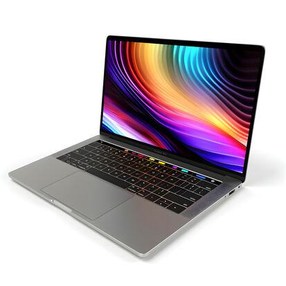
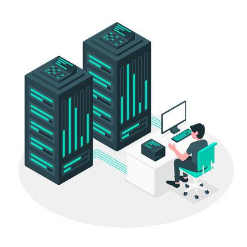
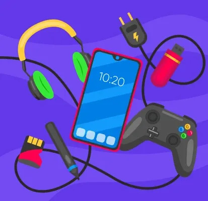

# کامپیوتر چیست؟

کامپیوتر یک **دستگاه الکترونیکی** است که داده‌ها را بر اساس دستورالعمل‌هایی که توسط **برنامه‌های نرم‌افزاری (Software Programs)** ارائه می‌شوند، پردازش می‌کند.
کامپیوتر ورودی (Input) را دریافت می‌کند، آن را با استفاده از **واحد پردازش مرکزی (Central Processing Unit – CPU)** پردازش می‌کند، اطلاعات را ذخیره می‌کند و در نهایت خروجی (Output) یا نتیجه تولید می‌کند تا وظایف مختلف را انجام دهد.

import ImageCarousel from "@site/src/components/ImageCarousel";
import slideImages from "./images/02_computer-and-its-types";

<ImageCarousel slideImages={slideImages} />
---

## انواع کامپیوترها

امروزه انواع مختلفی از کامپیوترها بر اساس نیاز کاربران مورد استفاده قرار می‌گیرند. برخی از مهم‌ترین انواع آن عبارت‌اند از:

### کامپیوتر رومیزی (Desktop)
کامپیوترهای رومیزی عمدتاً برای استفاده‌های روزمره به کار می‌روند. اجزای آن‌ها مانند **نمایشگر (Monitor)**، **صفحه‌کلید (Keyboard)**، **ماوس (Mouse)** و **واحد پردازش مرکزی (CPU)** به‌صورت جداگانه در کنار هم قرار دارند. از آنجا که این سیستم معمولاً روی میز قرار می‌گیرد، به آن «رومیزی» گفته می‌شود.

    

### لپ‌تاپ (Laptop)
لپ‌تاپ‌ها نسخه قابل‌حمل کامپیوترهای رومیزی هستند. تمام اجزا در یک واحد یکپارچه شده‌اند که امکان جابه‌جایی را فراهم می‌کند. این دستگاه‌ها برای کار در حال حرکت بسیار مناسب‌اند و معمولاً دارای **وب‌کم (Webcam)**، **بلوتوث (Bluetooth)** و **وای‌فای (Wi-Fi)** هستند.

    

### سرورها (Servers)
سرورها نوع خاصی از کامپیوترها هستند که برای مدیریت منابع شبکه استفاده می‌شوند. آن‌ها به سیستم‌ها و کامپیوترهای دیگر خدمات ارائه می‌دهند. از وظایف اصلی سرورها می‌توان به ایجاد پایگاه داده، میزبانی برنامه‌ها و پشتیبانی از سایر نرم‌افزارها اشاره کرد.

    

### تبلت‌ها (Tablets)
تبلت‌ها از لپ‌تاپ‌ها قابل‌حمل‌تر هستند. اندازه آن‌ها کوچک‌تر از لپ‌تاپ و بزرگ‌تر از گوشی‌های هوشمند است. وجود **صفحه‌نمایش لمسی (Touchscreen)** آن‌ها را برای وب‌گردی، بررسی محتوا و ارتباطات شخصی بسیار مناسب می‌کند.

### سایر دستگاه‌ها (Other Devices)
سایر دستگاه‌ها شامل **گوشی‌های هوشمند (Smartphones)**، **کنسول‌های بازی (Game Consoles)**، **تلویزیون‌های هوشمند (Smart TVs)** و موارد مشابه هستند.

    

---

## تعامل نرم‌افزار با سخت‌افزار چگونه است؟

وقتی شما ورودی‌ای را وارد می‌کنید (برای مثال، فشردن یک کلید روی صفحه‌کلید)، **سخت‌افزار (Hardware)** این ورودی را به **نرم‌افزار (Software)** ارسال می‌کند.
نرم‌افزار، ورودی را به **زبان قابل‌فهم ماشین (Machine-Readable Language)** که همان **دودویی (Binary)** است تبدیل می‌کند تا CPU بتواند آن را پردازش کند. سپس خروجی (مثلاً نمایش حرف «A») روی صفحه‌نمایش نشان داده می‌شود.

**مثال:**
1. شما کلید Shift و کلید A را روی صفحه‌کلید فشار می‌دهید.
2. نرم‌افزار این ورودی را به **کد ماشین (Machine Code)** تبدیل می‌کند و به CPU اطلاع می‌دهد که حرف «A» باید نمایش داده شود.
3. CPU ورودی را پردازش می‌کند و نمایشگر حرف «A» را نشان می‌دهد.

---

## ارتباط بین اجزای مختلف کامپیوتر

    

در ادامه برخی از اجزای مهم کامپیوتر به همراه توضیح آن‌ها آورده شده است:

| مؤلفه | توضیح |
|------------------|---------------------|
| واحد پردازش مرکزی (CPU) | CPU که اغلب «مغز کامپیوتر» نامیده می‌شود، مسئول اجرای دستورالعمل‌ها، انجام محاسبات و مدیریت وظایف سیستم است. این واحد شامل **واحد حساب و منطق (Arithmetic Logic Unit – ALU)** و **واحد کنترل (Control Unit – CU)** است. |
| مادربورد (Motherboard) | برد اصلی که تمام اجزای کامپیوتر را به هم متصل می‌کند و امکان ارتباط میان آن‌ها را فراهم می‌سازد. |
| حافظه (RAM) | **حافظه با دسترسی تصادفی (Random Access Memory – RAM)** داده‌ها را به‌صورت موقت و برای دسترسی سریع در زمان اجرای سیستم ذخیره می‌کند. |
| ذخیره‌سازی (Storage) | شامل **هارد دیسک (Hard Disk Drive – HDD)** و **درایو حالت جامد (Solid-State Drive – SSD)** که داده‌ها را به‌صورت دائمی ذخیره می‌کنند. |
| دستگاه‌های ورودی (Input Devices) | ابزارهایی برای وارد کردن داده به کامپیوتر، مانند صفحه‌کلید، ماوس و اسکنر. |
| دستگاه‌های خروجی (Output Devices) | ابزارهایی که نتیجه پردازش را نمایش می‌دهند یا تولید می‌کنند، مانند چاپگر و بلندگو. |

---

## نرم‌افزار چیست؟

نرم‌افزار مجموعه‌ای از دستورالعمل‌ها است که به کامپیوتر می‌گوید **چه کاری انجام دهد، چه زمانی انجام دهد و چگونه انجام دهد**.
نمونه‌هایی از نرم‌افزار شامل برنامه نقاشی در مایکروسافت، واتساپ و بازی‌های کامپیوتری هستند.

برای مثال، اگر بخواهیم حاصل جمع ۲ + ۲ را محاسبه کنیم، باید دستورالعمل‌های زیر را به کامپیوتر بدهیم:

1. دریافت دو مقدار
2. ذخیره‌سازی این دو مقدار
3. جمع کردن آن‌ها با استفاده از عملگر +
4. ذخیره نتیجه

**مفسر (Interpreter)** وظیفه دارد کد قابل‌خواندن برای انسان را به زبان ماشین (دودویی) تبدیل کند تا CPU بتواند آن را اجرا کند.

---

## سخت‌افزار چیست؟

سخت‌افزار به اجزای فیزیکی کامپیوتر گفته می‌شود که قابل لمس و مشاهده هستند. این اجزا شامل تمام دستگاه‌ها و قطعاتی می‌شوند که برای عملکرد کامپیوتر ضروری‌اند.
سخت‌افزار وظایفی مانند ذخیره داده، پردازش اطلاعات و نمایش نتایج را انجام می‌دهد. بدون سخت‌افزار، بستری برای اجرای نرم‌افزار وجود نخواهد داشت.

**انواع سخت‌افزار:**
- واحد پردازش مرکزی (CPU): اجرای دستورالعمل‌ها و محاسبات
- حافظه (RAM): ذخیره‌سازی موقت داده‌ها
- دستگاه‌های ذخیره‌سازی (HDD/SSD): ذخیره دائمی داده‌ها
- دستگاه‌های ورودی: تعامل کاربر با کامپیوتر
- دستگاه‌های خروجی: نمایش یا تولید نتایج پردازش

---

## دسته‌بندی کامپیوترها

کامپیوترها را می‌توان بر اساس معیارهای مختلفی مانند اندازه، توان پردازشی و نوع کارکرد دسته‌بندی کرد. در ادامه، این دسته‌بندی‌ها به‌صورت خلاصه و کاربردی ارائه شده‌اند.

### 1. بر اساس اندازه

- **میکروکامپیوترها (Microcomputers):**
میکروکامپیوترها برای استفاده فردی طراحی شده‌اند و رایج‌ترین نوع کامپیوتر محسوب می‌شوند. این دسته شامل **گوشی‌های هوشمند (Smartphones)**، **کامپیوترهای رومیزی (Desktops)** و **لپ‌تاپ‌ها (Laptops)** است.

- **مینی‌کامپیوترها (Minicomputers):**
مینی‌کامپیوترها نسبت به میکروکامپیوترها توان پردازشی بالاتری دارند و معمولاً در سازمان‌ها و کسب‌وکارهای متوسط استفاده می‌شوند. **سرورها (Servers)** نمونه‌ای رایج از این نوع کامپیوترها هستند.

- **مین‌فریم‌ها (Mainframes):**
مین‌فریم‌ها کامپیوترهای بسیار بزرگ و قدرتمندی هستند که برای پردازش حجم عظیمی از داده‌ها به کار می‌روند. این سیستم‌ها معمولاً در بانک‌ها، شرکت‌های بیمه و سازمان‌های دولتی استفاده می‌شوند.

- **ابرکامپیوترها (Supercomputers):**
ابرکامپیوترها قدرتمندترین نوع کامپیوترها هستند و برای انجام محاسبات بسیار پیچیده استفاده می‌شوند. این کامپیوترها بیشتر در زمینه‌هایی مانند **پژوهش‌های علمی (Scientific Research)**، **پیش‌بینی آب‌وهوا (Weather Forecasting)** و **شبیه‌سازی‌های پیشرفته (Advanced Simulations)** کاربرد دارند.

### 2. بر اساس توان پردازشی

- **کامپیوترهای شخصی (Personal Computers – PCs):**
رایج‌ترین نوع کامپیوتر که برای استفاده‌های روزمره مانند کارهای اداری، آموزشی و شخصی طراحی شده است.

- **سرورها (Servers):**
کامپیوترهایی که برای مدیریت، ذخیره و توزیع داده‌ها و منابع در یک شبکه استفاده می‌شوند و به چندین کاربر یا دستگاه به‌طور هم‌زمان خدمات ارائه می‌دهند.

- **مین‌فریم‌ها (Mainframes):**
سیستم‌هایی با توان پردازشی بسیار بالا که قادر به اجرای هزاران پردازش هم‌زمان هستند و در محیط‌های سازمانی بزرگ به کار می‌روند.

- **ابرکامپیوترها (Supercomputers):**
سیستم‌هایی با بیشترین توان پردازشی که برای محاسبات بسیار سنگین و تخصصی استفاده می‌شوند.

- **سیستم‌های نهفته (Embedded Systems):**
کامپیوترهای کوچکی که درون دستگاه‌های دیگر تعبیه شده‌اند، مانند خودروها، لوازم خانگی و تجهیزات پزشکی و وظایف مشخص و محدودی را بدون دخالت مستقیم کاربر انجام می‌دهند.

- **کامپیوترهای پوشیدنی (Wearable Computers):**
دستگاه‌های قابل‌حملی که روی بدن استفاده می‌شوند، مانند **ساعت‌های هوشمند (Smartwatches)** و **دستبندهای سلامتی (Fitness Trackers)**.

### 3. بر اساس کارکرد

- **کامپیوترهای آنالوگ (Analog Computers):**
در این نوع کامپیوترها، داده‌ها با استفاده از کمیت‌های فیزیکی پیوسته مانند ولتاژ یا فشار نمایش داده می‌شوند. یک **انتگرال‌گیر مکانیکی (Mechanical Integrator)** نمونه‌ای از کامپیوتر آنالوگ است.

- **کامپیوترهای دیجیتال (Digital Computers):**
رایج‌ترین نوع کامپیوترهای امروزی که داده‌ها را با مقادیر گسسته (معمولاً صفر و یک) پردازش می‌کنند. **گوشی‌های هوشمند (Smartphones)** و **کامپیوترهای شخصی (PCs)** نمونه‌هایی از این دسته هستند.

- **کامپیوترهای هیبریدی (Hybrid Computers):**
ترکیبی از کامپیوترهای آنالوگ و دیجیتال که از مزایای هر دو استفاده می‌کنند. این نوع کامپیوترها معمولاً در **تجهیزات پزشکی پیشرفته (Advanced Medical Equipment)** و سیستم‌های کنترل صنعتی به کار می‌روند.

