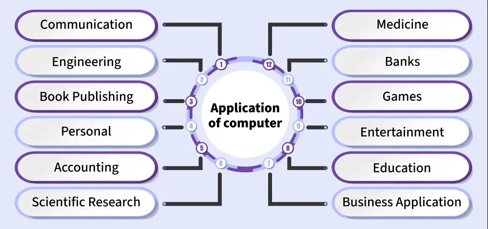

# کاربردهای پایه‌ای کامپیوترها

واژه‌ی کامپیوتر (Computer) از کلمه‌ی یونانی **محاسبه (Compute)** گرفته شده است که به معنای انجام محاسبات است. در گذشته، کامپیوتر به شخص یا دستگاهی گفته می‌شد که عملیات محاسباتی انجام می‌داد.
امروزه کامپیوترها در تمام جنبه‌های زندگی انسان مورد استفاده قرار می‌گیرند؛ از جمله در **خانه‌ها**، **کسب‌وکارها**، **مؤسسات آموزشی**، **سازمان‌های پژوهشی**، **حوزه پزشکی**، **ادارات دولتی** و **سرگرمی**.
در دنیای امروز، تصور رشد و پیشرفت فناوری بدون وجود کامپیوترها امکان‌پذیر نیست.

    

---

## کاربردهای اصلی کامپیوتر
در ادامه، مهم‌ترین حوزه‌هایی که کامپیوتر در آن‌ها نقش اساسی دارد بررسی می‌شود:

### علم

امروزه کامپیوتر مناسب‌ترین ابزار برای **جمع‌آوری (Collecting)**، **تحلیل (Analyzing)**، **دسته‌بندی (Classifying)** و **ذخیره‌سازی (Storing)** داده‌ها است.
کامپیوتر به یکی از مهم‌ترین ابزارها برای گسترش دانش در سطح ملی و بین‌المللی تبدیل شده است. همچنین این امکان را فراهم می‌کند که دانشمندان در مکان‌های مختلف جغرافیایی بتوانند به‌صورت هم‌زمان روی یک پروژه کار کرده و ایده‌های خود را به اشتراک بگذارند.

### سیستم‌های دفاعی

کامپیوترها در سیستم‌های دفاعی برای **ردیابی هواپیماها (Aircraft Tracking)**، **موشک‌ها (Missiles)**، **تانک‌ها (Tanks)** و انواع سلاح‌ها استفاده می‌شوند.
پس از شناسایی یک موشک توسط **سیستم راداری (Radar System)**، از **هوش مصنوعی (Artificial Intelligence)** برای هدف‌گیری و نابودی آن پیش از رسیدن به سطح زمین استفاده می‌شود.
همچنین کامپیوترها در **ردیابی GPS (GPS Tracking)**، کنترل وسایل نقلیه نظامی و نگهداری سوابق پرسنل نظامی نقش مهمی دارند.

### پزشکی

در حوزه پزشکی، کامپیوترها برای ثبت اطلاعات بیماران، پایش **ضربان قلب (Heart Rate)**، **سطح اکسیژن (Oxygen Level)** و **فشار خون (Blood Pressure)** استفاده می‌شوند.
همچنین در انجام جراحی‌ها، پزشکان کم‌تجربه‌تر می‌توانند از طریق **کنفرانس وب (Web Conferencing)** از راهنمایی پزشکان متخصص بهره‌مند شوند.

### آموزش

کامپیوترها نقش بسیار مهمی در **کلاس‌های آنلاین (Online Classes)**، دانلود منابع آموزشی از اینترنت و تعامل با سایر یادگیرندگان دارند.
علاوه بر این، از کامپیوتر برای **ثبت حضور و غیاب دانش‌آموزان (Attendance Tracking)** و تحلیل روش‌های یادگیری استفاده می‌شود.

### بانکداری

کامپیوترها به بانک‌ها کمک می‌کنند تا اطلاعات تعداد زیادی از دارندگان حساب را روی **سرور بانکی** ذخیره کنند.
تمامی تراکنش‌ها مانند **واریز (Deposit)** و **برداشت (Withdrawal)** توسط کامپیوتر انجام می‌شود.
همچنین بانک‌ها می‌توانند به‌راحتی تمام **دستگاه‌های خودپرداز (ATMs)** و دستگاه‌های چاپ دفترچه حساب را نظارت و مدیریت کنند.

### بخش‌های دولتی

دولت‌ها با استفاده از کامپیوتر می‌توانند بخش‌هایی مانند **خدمات جاده‌ای (Road Services)**، **راه‌آهن (Railway)**، پروژه‌های توسعه‌ای و منابع مالی را مدیریت و پایش کنند.
اطلاعات هر شهروند به‌صورت دیجیتال روی سرورها ذخیره می‌شود و امکان دسترسی و مدیریت دقیق آن فراهم است.

### سرگرمی

با استفاده از کامپیوتر می‌توان انواع **بازی‌های ویدیویی (Video Games)** را انجام داد و فیلم‌ها، سریال‌ها و برنامه‌های تلویزیونی را تماشا کرد.
همچنین کامپیوترها برای تولید محتوای سرگرم‌کننده مانند **میم‌ها (Memes)** استفاده می‌شوند که نقش مهمی در ایجاد سرگرمی و نشاط دارند.
