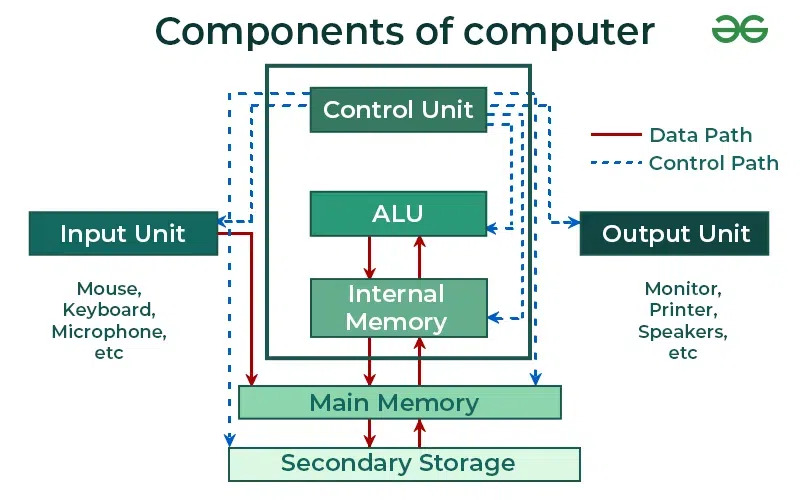

# سخت‌افزار کامپیوتر

سخت‌افزار کامپیوتر (Computer Hardware) به اجزای فیزیکی یک کامپیوتر گفته می‌شود که می‌توان آن‌ها را دید و لمس کرد. این اجزا با یکدیگر همکاری می‌کنند تا ورودی‌ها را پردازش کرده و بر اساس دستورهای کاربر، خروجی تولید کنند.
در این مقاله، انواع مختلف سخت‌افزار کامپیوتر، وظایف آن‌ها و نحوه تعامل آن‌ها بررسی می‌شود تا مشخص شود کامپیوتر چگونه کار می‌کند.

import ImageCarousel from "@site/src/components/ImageCarousel";
import slideImages from "./images/04_computer-hardware";

<ImageCarousel slideImages={slideImages} />

یک کامپیوتر به‌طور کلی دارای دو بخش اصلی است:

- **سخت‌افزار (Hardware)**
- **نرم‌افزار (Software)**

در این مقاله، تنها به بررسی **سخت‌افزار کامپیوتر** پرداخته می‌شود.

---

## سخت‌افزار کامپیوتر چیست؟

سخت‌افزار کامپیوتر شامل دستگاه‌ها و قطعات فیزیکی کامپیوتر است که می‌توان آن‌ها را دید و لمس کرد.
برای مثال: **[نمایشگر (Monitor)]()**، **[واحد پردازش مرکزی (Central Processing Unit – CPU)]()**، **[ماوس (Mouse)]()**، **[جوی‌استیک (Joystick)]()** و غیره.

با استفاده از این دستگاه‌ها، می‌توان عملیات مختلف کامپیوتر مانند [**ورودی (Input)** و **خروجی (Output)**]() را کنترل کرد.

> مطالعه بیشتر: [دستگاه‌های جانبی (Peripheral Device)]()

---

## بخش‌های سخت‌افزار کامپیوتر

این اجزای سخت‌افزاری به دسته‌های زیر تقسیم می‌شوند:

- دستگاه‌های ورودی (Input Devices)
- دستگاه‌های خروجی (Output Devices)
- دستگاه‌های ذخیره‌سازی (Storage Devices)
- اجزای سخت‌افزاری داخلی (Hardware Components)

### دستگاه‌های ورودی (Input Devices)

[دستگاه‌های ورودی]() به کاربران اجازه می‌دهند با وارد کردن داده یا فرمان با کامپیوتر تعامل داشته باشند. این دستگاه‌ها ورودی را به قالبی تبدیل می‌کنند که کامپیوتر قادر به پردازش آن باشد.

در ادامه برخی از دستگاه‌های ورودی توضیح داده می‌شوند:

- **صفحه‌کلید (Keyboard):**
پرکاربردترین دستگاه ورودی که شامل ۱۰۴ کلید است و کلیدهای حروفی، عددی و تابعی را در بر می‌گیرد. صفحه‌کلیدهای مدرن از طریق بلوتوث متصل می‌شوند و جایگزین اتصال‌های سیمی سنتی شده‌اند.

- **ماوس (Mouse):**
دستگاه اشاره‌گر که مکان‌نما را روی صفحه کنترل می‌کند. دارای دکمه چپ، راست و میانی برای انتخاب و تعامل است. حسگر داخلی ماوس سرعت حرکت را تشخیص داده و مکان‌نما را متناسب با آن تنظیم می‌کند.

- **اسکنر (Scanner):**
اسناد، تصاویر و سایر رسانه‌ها را اسکن کرده و آن‌ها را به قالب دیجیتال تبدیل می‌کند تا ویرایش یا پردازش شوند. عملکرد آن مشابه دستگاه‌های زیراکس است.

- **ترک‌بال (Trackball):**
دستگاه اشاره‌گر ثابت که دارای یک توپ است و کاربر با چرخاندن آن مکان‌نما را کنترل می‌کند. این دستگاه نسبت به ماوس فضای کمتری اشغال می‌کند.

- **قلم نوری (Light Pen):**
قلمی حساس به نور که برای ترسیم یا انتخاب اشیا روی نمایشگرهای CRT استفاده می‌شود و با تشخیص الگوهای رستری عمل می‌کند.

- **میکروفون (Microphone):**
صدا را به سیگنال‌های الکتریکی تبدیل می‌کند و برای تشخیص گفتار و اجرای فرمان‌های صوتی در کامپیوتر استفاده می‌شود.

- **تشخیص نوری کاراکتر (Optical Character Reader – OCR):**
متن‌های چاپی یا دست‌نویس را اسکن کرده و با تشخیص نور بازتاب‌شده از کاراکترها، آن‌ها را به داده دیجیتال تبدیل می‌کند.

- **بارکدخوان (Bar Code Reader):**
بارکدها را خوانده و به داده دیجیتال تبدیل می‌کند. بارکد شامل خطوط روشن و تیره‌ای است که اطلاعات را رمزگذاری می‌کنند.

### دستگاه‌های خروجی (Output Devices)

دستگاه‌های خروجی نتایج پردازش‌های کامپیوتر را به شکلی قابل فهم برای انسان نمایش می‌دهند.

- **نمایشگر (Monitor):**
اصلی‌ترین دستگاه خروجی که به آن **[واحد نمایش تصویری (Visual Display Unit – VDU)]()** نیز گفته می‌شود و شبیه صفحه تلویزیون است. نمایشگر برای نمایش متن، ویدیو، تصویر و اطلاعات دیگر استفاده می‌شود.

- **()[چاپگر (Printer)]:**
داده‌ها را به‌صورت متن یا تصویر روی کاغذ چاپ می‌کند. چاپگرها می‌توانند رنگی یا سیاه‌وسفید باشند. انواع مختلفی از چاپگر وجود دارد، مانند [چاپگر لیزری، ماتریسی]() و جوهرافشان.

- **پلاتر (Plotter):**
مشابه چاپگر است اما در ابعاد بزرگ‌تر. پلاتر برای تولید نقشه‌های بزرگ، نقشه‌های معماری و طراحی‌های باکیفیت استفاده می‌شود.

- **بلندگو (Speakers):**
دستگاه خروجی صوتی که برای پخش موسیقی و هر نوع صدای دیگر استفاده می‌شود.

### دستگاه‌های ذخیره‌سازی (Storage Devices)

برخی دستگاه‌ها برای ذخیره داده استفاده می‌شوند و به آن‌ها **حافظه‌های جانبی (Secondary Storage Devices)** گفته می‌شود.

#### 1. [دیسک فشرده (Compact Disc – CD)]()

دیسک فشرده دایره‌ای شکل است و از شیشه نازک پوشش‌دار و پلاستیک پلی‌کربنات ساخته شده است. ظرفیت ذخیره‌سازی آن بین ۶۰۰ تا ۷۰۰ مگابایت است. قطر استاندارد آن ۱۲ سانتی‌متر، قطر سوراخ مرکزی حدود ۱.۵ سانتی‌متر و ضخامت آن ۱.۲ میلی‌متر است.

انواع CD عبارت‌اند از:

- **[CD-ROM (Read Only Memory)]():**
محتوای آن توسط کاربر قابل پاک یا ویرایش نیست و فقط ناشر به داده‌های درج‌شده روی آن دسترسی دارد. برای آلبوم‌های موسیقی و بسته‌های نرم‌افزاری استفاده می‌شود.

- **CD-R (Recordable):**
داده‌ها فقط یک‌بار روی آن ذخیره می‌شوند و پس از آن فقط قابل خواندن هستند.

- **CD-RW (Rewritable):**
امکان پاک‌کردن و بازنویسی چندباره داده‌ها را فراهم می‌کند.

#### 2. [دی‌وی‌دی (Digital Video / Versatile Disc – DVD)]()

DVD مشابه CD است اما امکانات و ظرفیت بیشتری دارد. DVD در قالب تک‌لایه و دولایه عرضه می‌شود.
ظرفیت‌ها به شرح زیر است:

- یک‌طرفه تک‌لایه: 4.7 گیگابایت
- یک‌طرفه دولایه: 8.5 گیگابایت
- دوطرفه تک‌لایه: 9.4 گیگابایت
- دوطرفه دولایه: 17 گیگابایت

انواع DVD عبارت‌اند از:

- **[DVD-ROM:]()** فقط خواندنی
- **[DVD-R / DVD+R:]()** یک‌بار قابل ضبط
- **DVD-RW / DVD+RW:** قابل بازنویسی تا ۱۰۰۰ بار
- **[DVD-RAM:](#)** قابل بازنویسی تا ۱۰۰٬۰۰۰ بار و با [امنیت داده](#) بالا

#### 3. دیسک سخت (Hard Disk)

[دیسک سخت]() یک حافظه غیرفرار است که داده‌ها را روی سطح مغناطیسی صفحات سخت ذخیره می‌کند. اندازه آن معمولاً ۳.۵ اینچ برای کامپیوترهای رومیزی و ۲.۵ اینچ برای لپ‌تاپ‌ها است.

انواع آن عبارت‌اند از:

- **دیسک سخت داخلی (Internal Hard Disk):**
داخل کیس قرار دارد و ظرفیت آن با گیگابایت یا ترابایت بیان می‌شود. سریع و مناسب ذخیره [برنامه‌ها و فایل‌های حجیم]() است.

- **کارتریج‌های داخلی (Internal Cartridges):**
برای رفع مشکل عدم جداسازی آسان دیسک داخلی معرفی شدند. ظرفیت آن‌ها بین ۲ تا ۱۶۰ گیگابایت است.

- **بسته‌های دیسک سخت (Hard Disk Packs):**
در سازمان‌هایی مانند بانک‌ها و نهادهای دولتی استفاده می‌شوند و ظرفیت آن‌ها به پتابایت می‌رسد.

### اجزای سخت‌افزاری داخلی (Hardware Components)

#### 1. واحد پردازش مرکزی (CPU)

CPU به‌عنوان قلب کامپیوتر شناخته می‌شود و شامل:

- واحد کنترل (Control Unit)
- [واحد حساب و منطق (Arithmetic Logic Unit – ALU)]()
- [واحد حافظه (Memory Unit)]()

    

ورودی از طریق دستگاه‌های ورودی به حافظه ارسال می‌شود. واحد کنترل دستورها را دریافت کرده و به ALU منتقل می‌کند. ALU عملیات محاسباتی و منطقی را انجام داده و نتیجه در حافظه ذخیره شده و به دستگاه‌های خروجی ارسال می‌شود.

#### 2. [مادربورد (Motherboard)]()

برد اصلی داخل کامپیوتر که تمامی اجزا به‌صورت مستقیم یا غیرمستقیم به آن متصل هستند. شامل اسلات‌های [RAM]()، کنترلرها و چیپ‌ست‌های سیستمی است.

#### 3. حافظه با دسترسی تصادفی (Random Access Memory – RAM)

حافظه‌ای موقت و فرار که داده‌ها و برنامه‌های در حال اجرا را نگه می‌دارد. با خاموش شدن سیستم، داده‌ها پاک می‌شوند.

- **[SRAM (Static RAM)]():** سریع، گران، بدون نیاز به Refresh، مانند حافظه کش
- **[DRAM (Dynamic RAM)]():** ارزان‌تر، کندتر، نیازمند Refresh، مانند حافظه اصلی

#### 4. درگاه VGA (Video Graphics Array Port)

درگاهی برای اتصال نمایشگر. بررسی اتصال شل، کابل آسیب‌دیده یا نمایشگر خراب از مراحل عیب‌یابی آن است. هوای فشرده برای تمیزکاری استفاده می‌شود.

#### 5. منبع تغذیه (Power Supply)

تمام قطعات سیستم را برق‌رسانی می‌کند و از طریق کابل برق به پریز متصل می‌شود.

#### 6. فن خنک‌کننده (Cooling Fan)

برای جلوگیری از داغ شدن بیش‌ازحد سیستم استفاده می‌شود. در سیستم‌های پرمصرف ممکن است چند فن وجود داشته باشد.

#### 7. دیسک سخت (Hard Drive)

دستگاه ذخیره داده که فایل‌ها، برنامه‌ها و اطلاعات را روی صفحات مغناطیسی ذخیره می‌کند. خرابی آن می‌تواند باعث از دست رفتن داده شود.

---

## رابطه بین سخت‌افزار و نرم‌افزار

| دسته‌بندی | سخت‌افزار | نرم‌افزار |
|---------|---------|---------|
| تعریف | اجزای فیزیکی انجام‌دهنده عملیات | برنامه‌ها و کاربردها |
| مثال | CPU، RAM، دیسک سخت، نمایشگر | سیستم‌عامل، برنامه‌ها |
| هدف | اجرای فیزیکی و ذخیره داده | پردازش داده و رابط کاربری |
| وابستگی | برای کارکرد به نرم‌افزار نیاز دارد | برای اجرا به سخت‌افزار نیاز دارد |
| تعامل | تعامل مستقیم با سیستم | تعامل غیرمستقیم از طریق سخت‌افزار |
| ارتقا | تعویض یا افزودن قطعه | به‌روزرسانی نسخه |
| هزینه | معمولاً بالاتر | معمولاً کمتر |
| نصب | نیازمند نصب فیزیکی | نصب نرم‌افزاری یا آنلاین |
